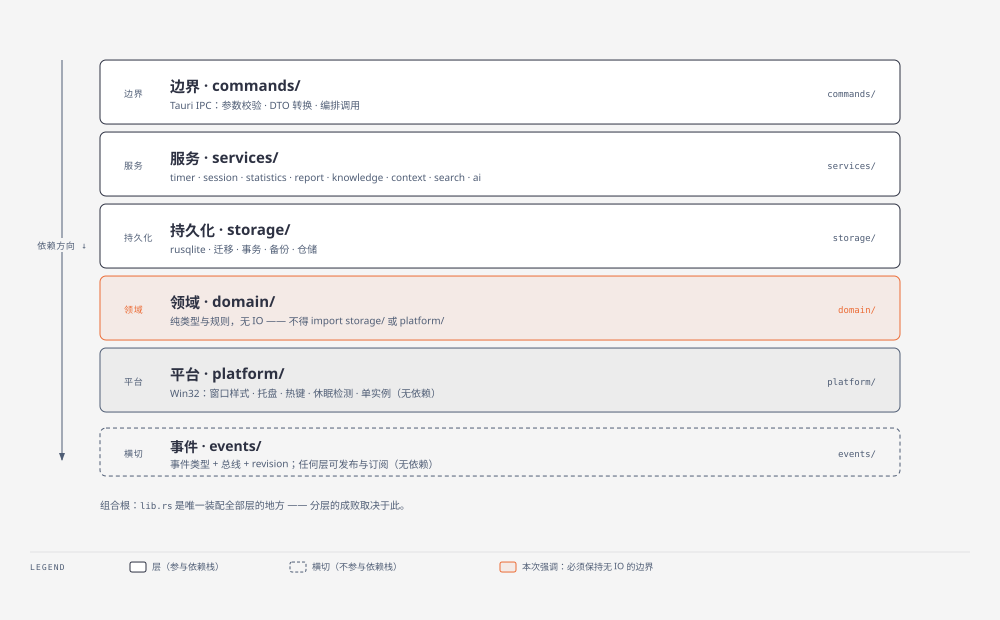
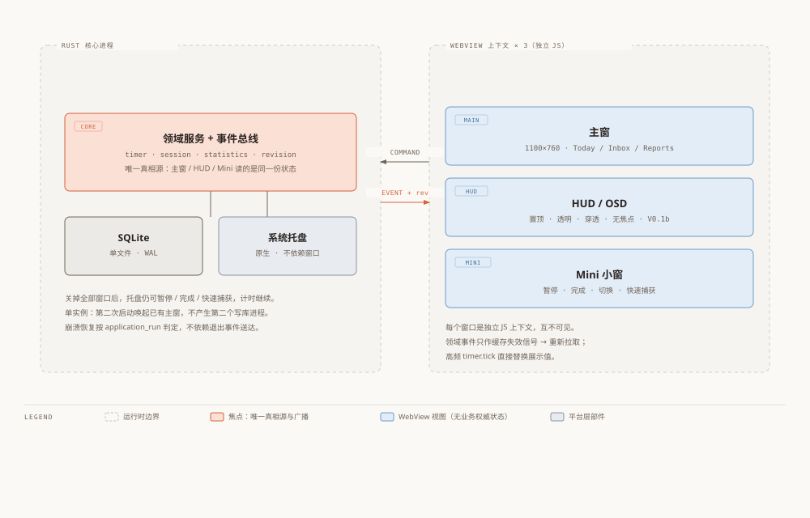
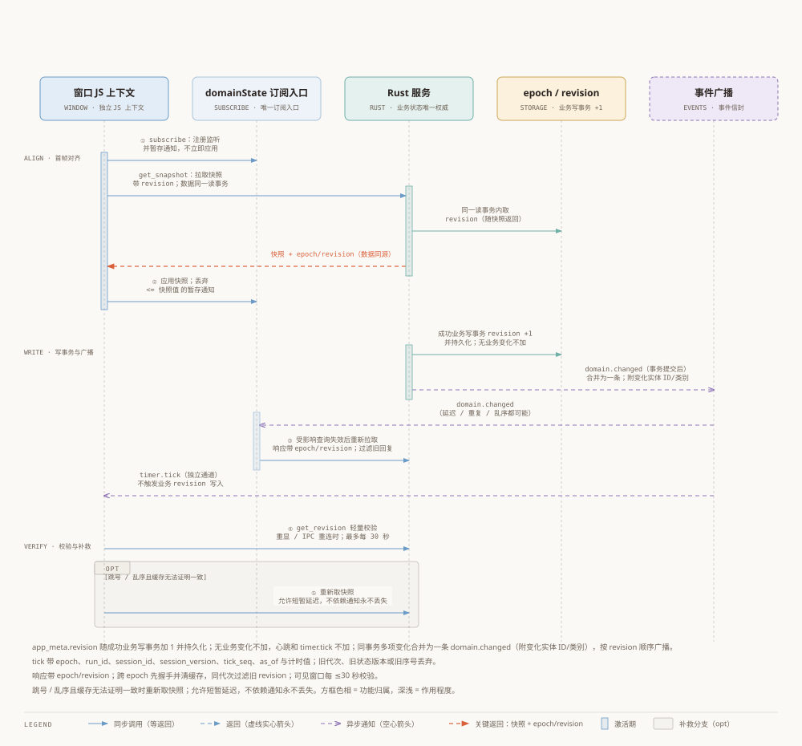
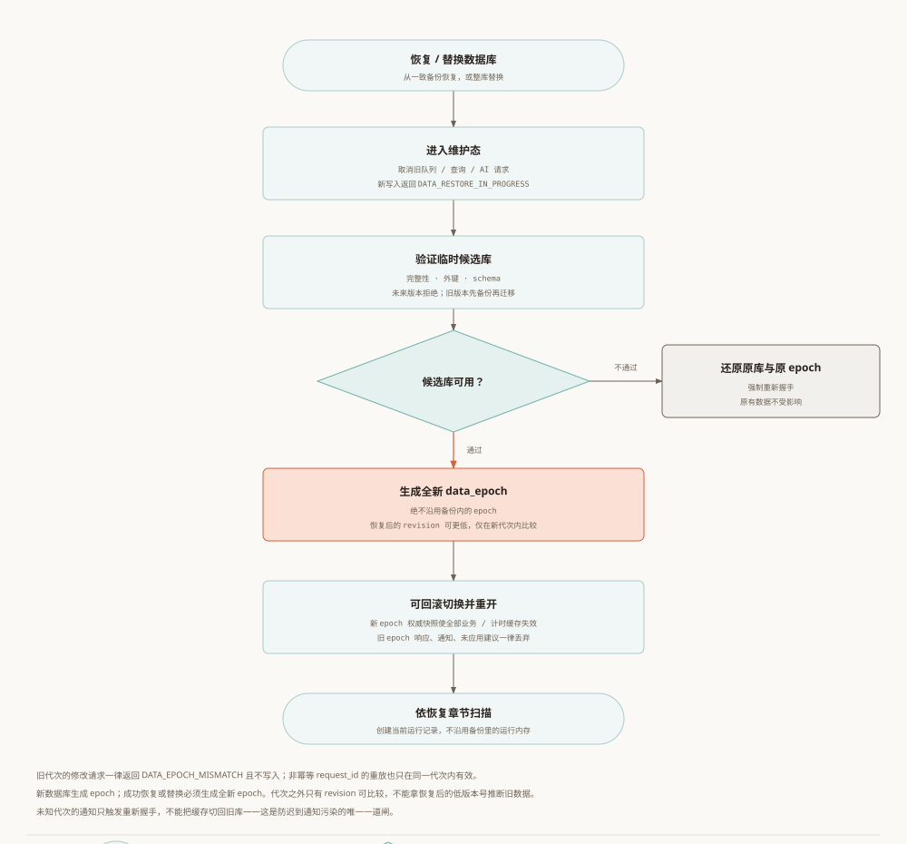
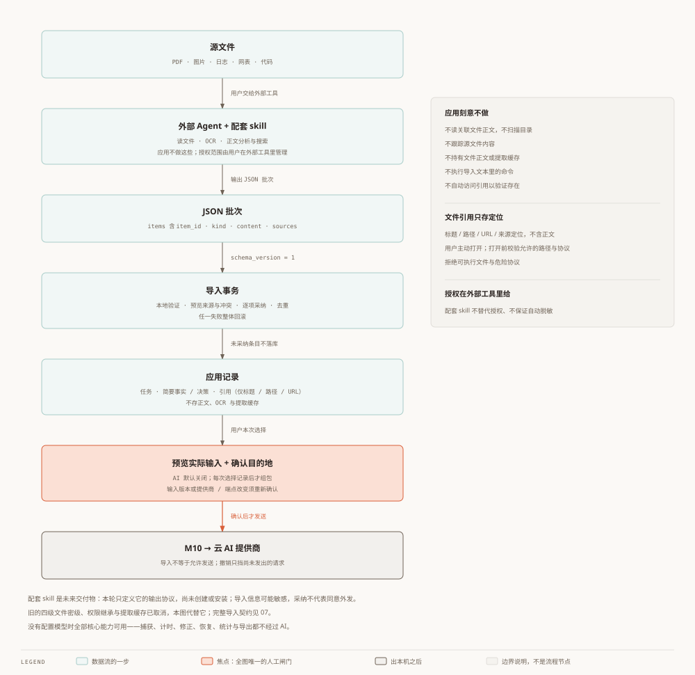

# Worktrace — Overall Architecture

Status: revised draft for user review. Date: 2026-10-03. [Chinese](00-architecture.zh.md).
See [product vision](../../../PROJECT_SPEC.md) and [review notes](06-review-notes.en.md). This is target design, not implemented behaviour; the repository still has the initial frontend and greet command.

## 1. Scope and document authority

A local task, effort-recording and review tool for individual engineering work. Keep Local First, AI Optional and User > Rule > AI. No generic agent, plugin marketplace, Office/CAD replacement or workflow engine.

PROJECT_SPEC preserves vision/original milestones; 04 owns acceptance scope, 05 dependencies/order, 02 accounting/data, 03 technical rationale and 99 terminology. R-01–R-08 are confirmed; technical probes remain open, and this protocol/recovery revision awaits review. Record new choices separately in 06; implementation status does not mean approval. Chinese is the working master, English updated together. Resolve conflicts rather than giving every document overriding authority.

## 2. Stack and topology

Tauri 2, React 19, TypeScript 6, Vite 8, pnpm. Ant Design is the proposed sole component library; dependency cleanup follows design review. Preserve copied components. DockviewDemo is not automatically product UI; R-04 fixes the initial layout; keep dockview dependencies/demo outside V0.1 production entries.

There is one authoritative Rust application core; WebView/system rendering can use additional OS processes. Rust owns business authority, SQLite persistence, React rebuildable query caches/UI state. Windows may briefly disagree; synchronization converges rather than guaranteeing identical displays at every instant.

Each main/HUD/Mini window has its own JS context. Window closure does not stop the core. Tray actions call the same services. Acquire single-instance ownership before database/timer initialization; a second launch may create a temporary process which forwards activation and exits, never another core.

Separate lightweight HUD/Mini entries are proposed; one entry with lazy loading is a valid fallback. Validate multi-entry configuration against installed Vite 8 rather than assuming old option names. Grant least-needed window capabilities; HUD is read-only by default. Rust controls files, outbound requests and mutations.

## 3. Boundaries and transactions

| Directory | Responsibility | Dependencies |
| --- | --- | --- |
| domain/ | Pure types, transitions, validation | Pure event types, no runtime bus or IO |
| storage/ | SQLite, migrations, transactions, backups, queries | domain, pure event types |
| platform/ | OS windows/tray/lock/hotkeys/single instance | Tauri/OS adapters, no business decisions |
| services/ | Intent orchestration, timer/statistics/context/AI | domain, storage, platform, events |
| commands/ | Inputs, errors/DTOs, service calls | services, domain types |
| events/ | Pure types plus separate runtime dispatch adapter | Pure types dependency-free; dispatch may use Tauri |

lib.rs assembles the application. Commands never directly issue SQL; domain has no IO; storage does not call platform. M11/composition root connects native callbacks to services.

Complete consistency-critical operations directly in one service transaction: finish sessions, update task result and increment revision. Never depend on asynchronous event subscribers to finish required writes. Statistics aggregate on demand.

Run synchronous DB work inside a controlled blocking boundary; never hold connection locks across await. Choose a serialized DB worker or controlled spawn_blocking after an M01 probe. Validate invariants in write transactions with database constraints as backup. Pause writes for backup/restore; specify busy_timeout, WAL, FKs, pre-migration backup and disk-full handling. Use a consistent SQLite backup API or verified VACUUM INTO, not a raw copy of a live WAL main file.

> The dependency direction is always downward; `events/` is cross-cutting and outside the stack.

> The core process holds all state; the three webviews are independent subscribers.

## 4. IPC and errors

Commands follow intent and return aggregate views without N+1. Generate TS DTO types from Rust after validating tooling. Mutations carry expected_row_version; conflicts return VERSION_CONFLICT. AI requests retain input versions and do not apply to changed tasks.

Expected failures use Result<T,AppError> with code/message/redacted detail. Panic is a defect; current release panic=abort terminates the process and cannot be promised convertible to AppError. Diagnostics/recovery remain necessary; avoid unwrap on normal user/IO failures.

Post-commit broadcast failure is diagnostic, not transaction failure. Prevent duplicate submissions. Automatic retries of non-idempotent commands require request_id plus a replay result stored in the same transaction; otherwise do not retry blindly.

## 5. Data epochs, revisions and timer protocol

app_meta stores data_epoch (UUID) and revision. Create an epoch for a new DB; successful restore/replacement generates a new one, never reuses the backup epoch. Increment revision per business write transaction; coalesce one domain.changed. No-op writes, heartbeats and ticks do not increment it. Read data/epoch/revision in one snapshot transaction.

Business responses/snapshots/events carry data_epoch/revision. Mutations require expected_data_epoch/expected_row_version; mismatch returns DATA_EPOCH_MISMATCH without writes. request_id replay is scoped to the epoch. Compare revisions only within an epoch.

1. Subscribe/buffer before fetching a consistent snapshot.
2. An authoritative new-epoch snapshot invalidates all query/timer caches; discard old-epoch responses/events/unapplied suggestions. An unfamiliar event epoch only triggers a handshake, never switches caches directly; delayed events cannot switch back to an old DB.
3. After applying the snapshot, discard same-epoch notifications at/below its revision. Coalesce affected-view refreshes and reject older replies.
4. On visibility/resume/reconnection and at most every 30 seconds while visible, get_revision returns epoch+revision. Hidden windows check before display; lost final events still converge.
5. Refetch on unresolvable gaps/reordering. During restore reject new writes with DATA_RESTORE_IN_PROGRESS, cancel old queued work/queries/AI requests and re-handshake after completion.

Envelope: data_epoch/event/revision/at (Unix ms)/payload. Broadcast in commit order; failure is diagnostic, never rollback.

Ticks and timer queries carry data_epoch/run_id/session_id/session_version (work_session.row_version)/tick_seq/as_of/active_ms/remaining_ms/state. Sequence increases within a run; queries/command results return the same display sequence baseline. Check epoch/run/session/state version before sequence; a pre-pause tick cannot overwrite the paused display even if its sequence is newer. An unfamiliar newer session version triggers a timer snapshot, not frontend business transitions.

A single serial timer coordinator handles starts/pauses/resumes/finishes/system events: sample clock and build interval facts, commit DB/session_version, apply the memory baseline, then return/broadcast state. Ticks/queries sample through this coordinator and cannot observe the commit/baseline gap. Failed commit applies no memory change; a post-commit baseline failure enters fault recovery rather than ordinary retryable failure. Persistence is the recovery source; memory baselines are rebuildable live state.

> The diagram shows normal synchronization; epoch switches, timer state versions and restore queue isolation are in the next figure.

## 6. Frontend and outbound data

One domainState subscription entry per JS context with cleanup and hooks for pages. Business events invalidate queries; ticks replace display values. Begin with a simple store such as useSyncExternalStore, but permit a cache/state library when justified; library avoidance is not what establishes Rust authority.

AI receives M09 bundles of selected records only. AI is off by default; preview actual inputs and confirm provider/endpoint per action. Keep task suggestions and summaries, no linked-file body access or extraction caches. Imported Agent results require review and never automatically send. Credentials stay in OS storage; logs exclude bodies/secrets.

## 7. Open verification and index

Probe Windows HUD click-through/no-focus/DPI, multi-entry dev/package paths, database threads and shutdown/backup races, and timer behaviour on offline/lock/suspend/clock changes. No empirical outcome is claimed yet. HUD probes do not block the recording loop.

[Modules](01-module-breakdown.en.md) · [Data](02-data-model.en.md) · [ADRs](03-adr.en.md) · [Acceptance](04-functional-spec.en.md) · [Roadmap](05-roadmap.en.md) · [Glossary](99-glossary.en.md)

## 8. AI input and external Agent boundary

No four-level file classification, file-permission inheritance or extraction cache. Keep AI-off mode, per-action selection/preview/confirmation and destination/input-version checks. Changes require renewed confirmation; cancellation blocks unsent requests, not recall. Users manage external Agent permissions in that tool. Import never grants permission to send. See [07](07-scope-and-agent-import.en.md).

[Module breakdown](01-module-breakdown.en.md) · [Data model](02-data-model.en.md) · [ADR](03-adr.en.md) · [Functional spec](04-functional-spec.en.md) · [Roadmap](05-roadmap.en.md) · [Review notes](06-review-notes.en.md) · [Scope and import contract](07-scope-and-agent-import.en.md) · [Glossary](99-glossary.en.md)

See [08: timing, phases, AI and report snapshots](08-implementation-contracts.en.md).
