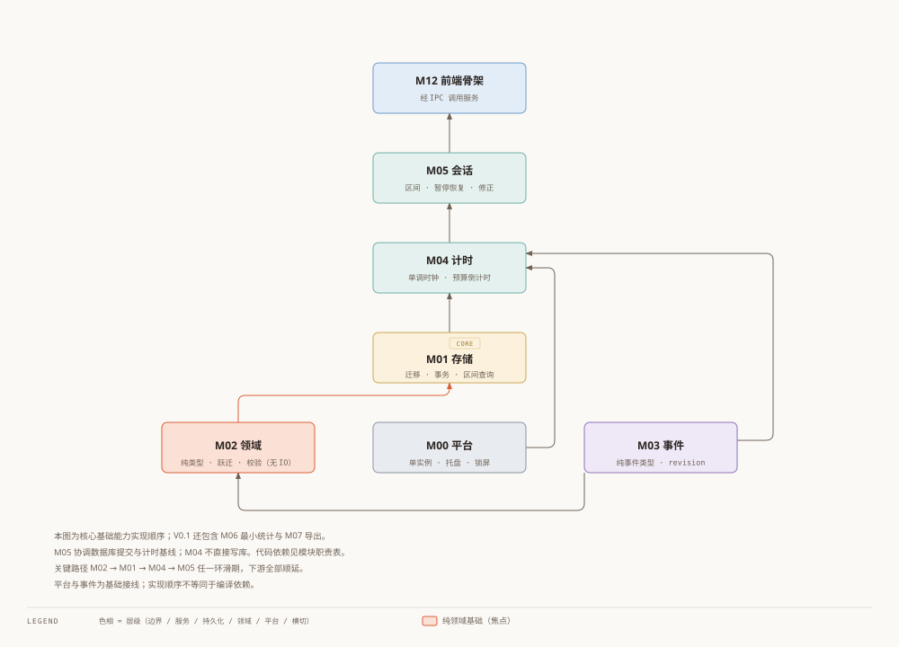
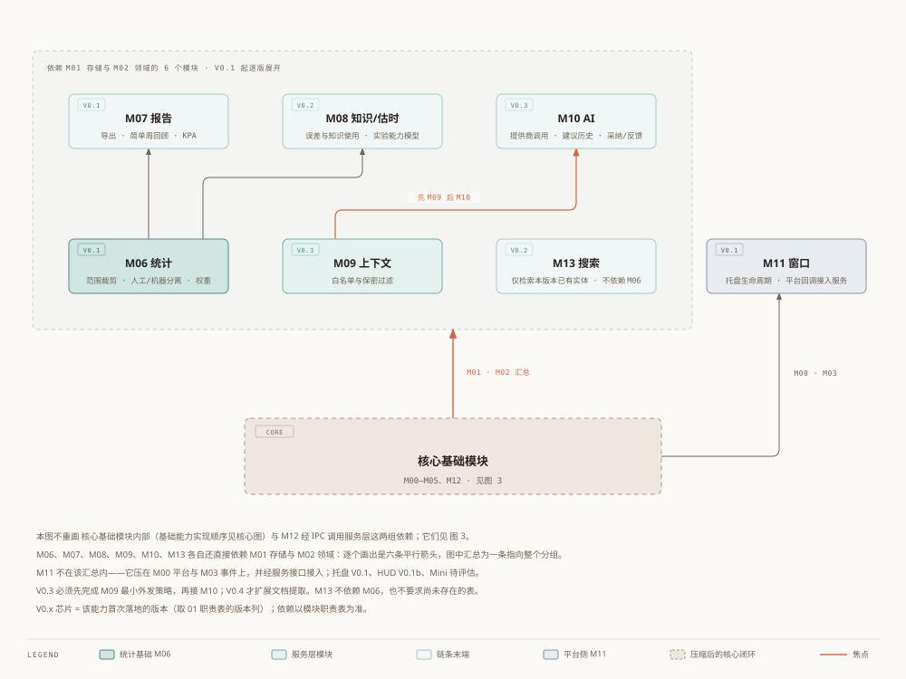

# Worktrace 模块分解

状态：评审修订草案；日期：2026-10-03。
[总体架构](00-architecture.zh.md) · [另一语言](01-module-breakdown.en.md)

## 1. 职责与版本

| ID | 模块 | 职责 | 依赖 | 版本 |
| --- | --- | --- | --- | --- |
| M00 | 平台 | 单实例、锁屏/休眠、热键与原生窗口适配；无业务规则 | 无领域依赖 | V0.1；HUD 在 V0.1b |
| M01 | 存储 | 迁移、事务、约束、区间查询、备份恢复、revision 持久化 | M02 纯类型 | V0.1 |
| M02 | 领域 | 实体、跃迁表、范围/重叠/层级校验；无 IO | M03 纯事件类型 | V0.1，按版本扩展 |
| M03 | 事件 | 纯类型和独立广播适配、revision 协议；不做关键业务补写 | 类型无依赖；广播适配 Tauri | V0.1 |
| M04 | 计时 | 单调时钟、预算倒计时、tick、锁屏/休眠校正 | M02、M03、M00 | V0.1；Pomodoro V0.2 |
| M05 | 会话 | 工作区间、暂停/恢复/结束、恢复确认、补录修正 | M01、M02、M04 | V0.1；并发/打断 V0.2 |
| M06 | 统计 | 范围裁剪、人工/机器分离、权重与可核对 DTO | M01、M02 | 最小集 V0.1；扩展 V0.2 |
| M07 | 报告 | 导出/简单周回顾；扩展范围与可追溯 KPA 证据 | M06、M01、M02（纯类型） | 最小集 V0.1；报表 V0.2；KPA V0.5 |
| M08 | 知识/估时 | 误差、知识使用、自评与短板措施；可选熟练度 | M01、M02、M06 | 误差 V0.2；评分 V0.5 |
| M09 | 上下文 | 所选记录组包；简要事实/决策、引用与 Agent 导入 | M01、M02 | 最小集 V0.3；完整 V0.4 |
| M10 | AI | 提供商调用、建议历史、输入版本、采纳/反馈；可禁用 | M09、M01、M02 | V0.3 |
| M11 | 窗口 | 窗口/托盘生命周期；平台回调接入服务 | M00、M03；服务接口 | 托盘 V0.1；HUD V0.1b；Mini 待评估 |
| M12 | 前端 | 外壳、业务页、状态镜像、生成类型、恢复/修正 UI | 经 IPC 调用服务 | V0.1 起 |
| M13 | 搜索 | 仅检索本版本已有实体，中文/编号搜索测试 | M01、M02 | 基础 V0.2；上下文 V0.4 |

## 2. 边界与关键路径

模块编号是职责标识，不是 14 个 crate，也不要求每个模块实现前先写一套独立长文。纯事件类型与运行时广播必须分开，领域层只能引用前者。M01 负责 revision 持久化，M03 负责协议与分发，避免事件模块反向依赖仓储形成环。

核心实现链：M02 → M01 → M04/M05 → M06 最小统计 → M07 最小导出与回顾；M12 外壳可以使用 mock 提前搭建，随后逐条接入。M00 的单实例在持久化初始化前生效；托盘与服务接线由 M11 完成。HUD 实验不阻塞这条链。

V0.3 先完成 M09 所选输入组包与预览，再接 M10；V0.4 接入结构化 Agent 结果，不解析源文件。M13 不依赖 M06，不要求尚未存在的表。

> 图：核心基础能力的实现顺序，箭头不代表直接代码依赖；V0.1 另含 M06/M07 最小能力。

> 图：核心基础模块压成一块做地基；服务层与扩展链在上。六个模块对 M01/M02 的依赖合并为一条汇总箭头，不画六条平行线。
> 注意两张图读法不同：本图是代码依赖方向，图 3 的箭头表示实现顺序。

## 3. 每次实现的交付要求

每个纵向功能交付命令契约、持久化变更、界面、必要测试与可验收演示。不创建只为看起来分层的空目录。测试重点是跃迁、事务回滚、恢复、并发与统计边界，不是一函数一条机械测试。功能依赖完整性以 04/05 为准，待产品选择以 06 为准。

当前产品边界（2026-10-03）：个人工作记录与任务管理，包含能力短板分析和 KPA 工作证据整理；文件读取、OCR、正文提取和正文搜索交给外部 Agent 与配套 skill。见 [范围与导入契约](07-scope-and-agent-import.zh.md)。
