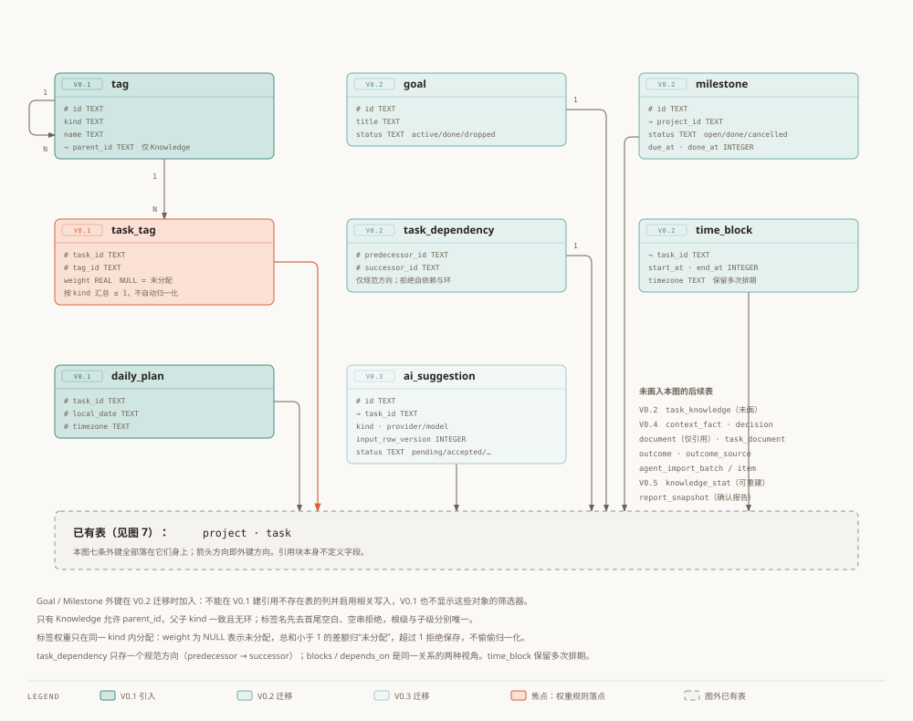
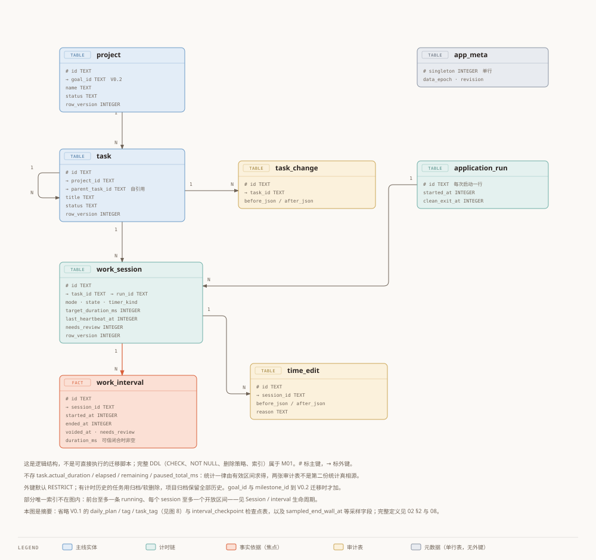
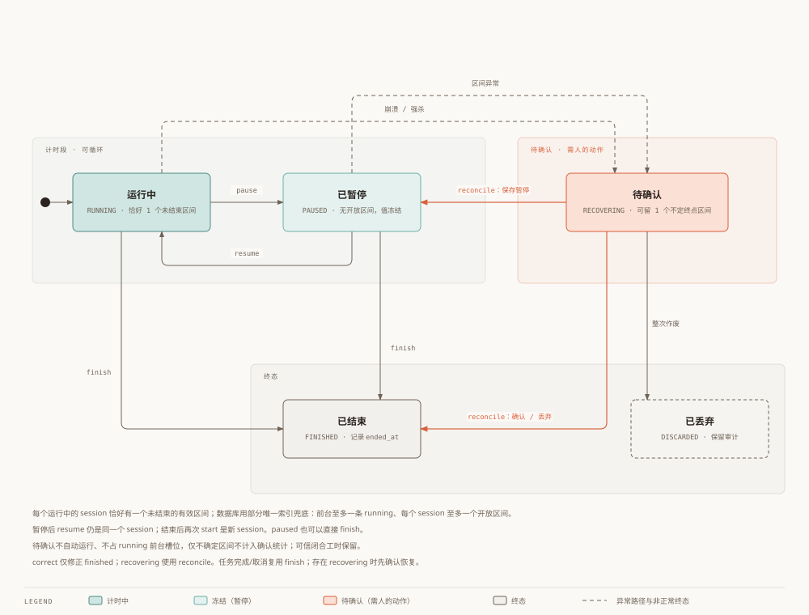
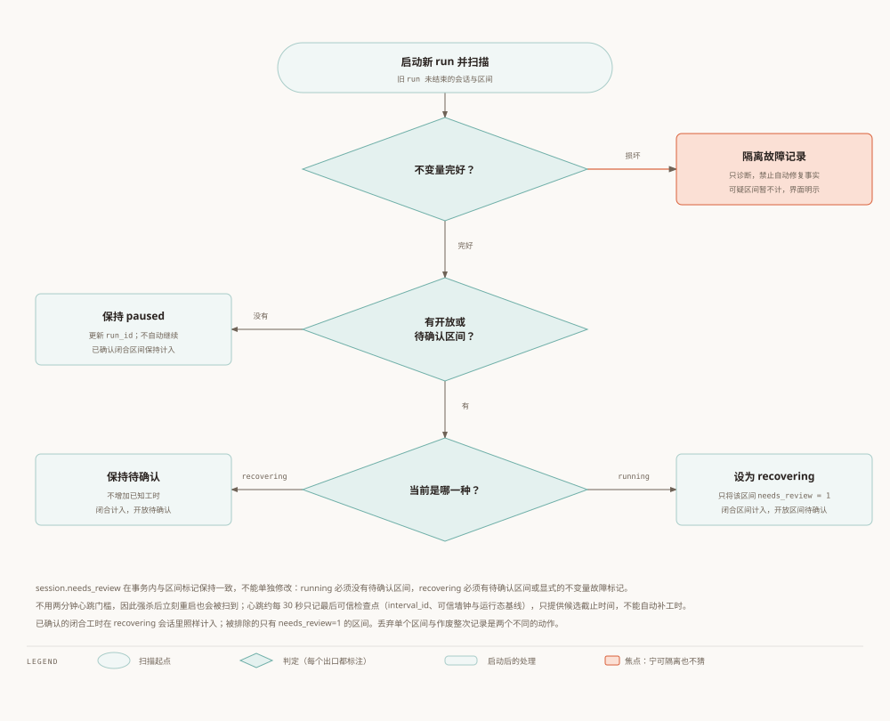
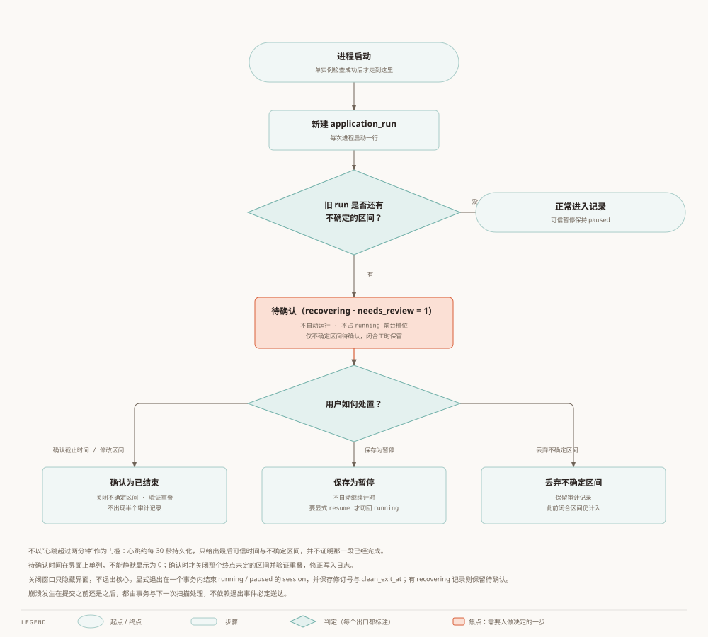
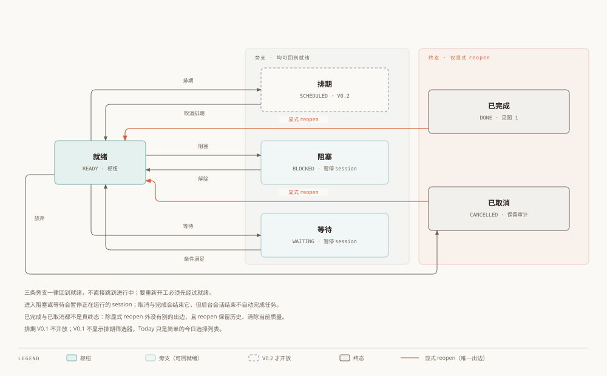
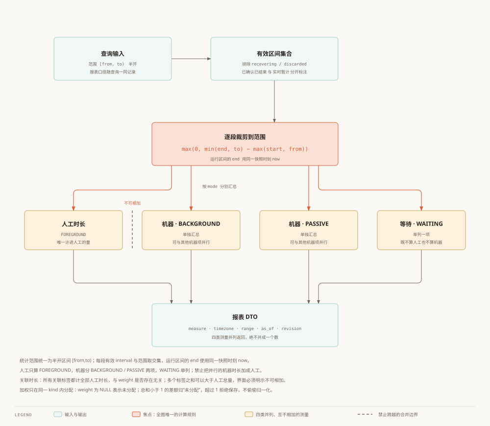
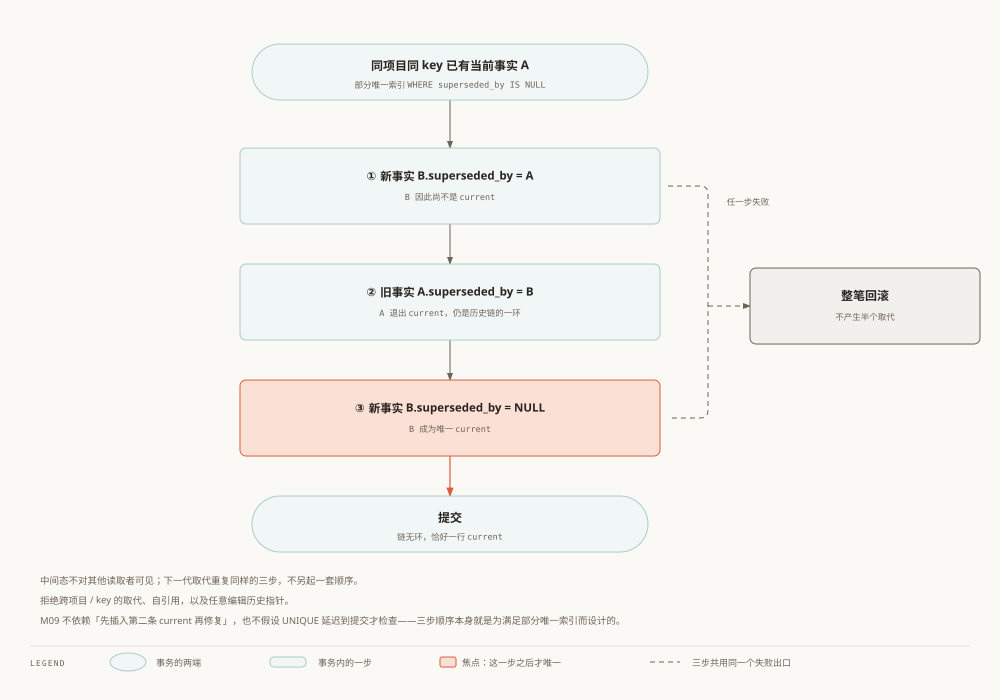

# Worktrace 数据模型

状态：评审修订草案，待用户评估。日期：2026-10-03。
上游：[总体架构](00-architecture.zh.md)；对应：[英文版](02-data-model.en.md)。
本次替换旧模型中的暂停累计方案；以下是逻辑结构，不是可直接执行的迁移脚本。

## 1. 版本与实体

| 版本 | 存储对象 |
| --- | --- |
| V0.1 | app_meta、application_run、interval_checkpoint、project、task、work_session、work_interval、time_edit、task_change、daily_plan、tag、task_tag |
| V0.2 | goal、milestone、task_dependency、time_block、task_knowledge（实际使用标记）、phase_checkpoint（休息阶段检查点）、pomodoro_cycle（轮次预算与区间归属） |
| V0.3 | ai_suggestion、ai_feedback；本次 AI 输入/目的地确认记录 |
| V0.4 | context_fact、decision、document（仅引用）、task_document、outcome、outcome_source、agent_import_batch/item |
| V0.5 | knowledge_stat（可重建派生缓存）、report_snapshot（确认报告） |



> 图：辅助表与后续迁移表。色深 = 引入越早；七条外键都指向图外的 project / task，统一收束到底部的引用块。

Goal/Milestone 外键在 V0.2 迁移时加入；不能在 V0.1 建引用不存在表的列并启用相关写入。V0.1 不显示这些对象的筛选器。实体 ID 使用 UUID 字符串；所有主键显式 NOT NULL（完整 DDL）；所有时间戳和时长单位分别为 Unix 毫秒、毫秒。UI 可显示分钟。

Project 可包含多个 Task；Task 自引用，叶子 Task 称 Action。Task 下有多个 WorkSession，每个 session 有一到多个有效工作区间 work_interval。它不是 V1 的活动细分 SessionSegment：这里只记录实际工作的起止，用于暂停与跨日报表。

## 2. 逻辑结构与数据库约束

```sql
-- Logical schema: full executable DDL and migrations belong to M01.
app_meta(singleton INTEGER PRIMARY KEY, data_epoch TEXT NOT NULL, revision INTEGER NOT NULL)
application_run(id TEXT PRIMARY KEY, started_at INTEGER NOT NULL, clean_exit_at INTEGER)
goal(id TEXT PRIMARY KEY, title TEXT NOT NULL, description TEXT, status TEXT NOT NULL,
     created_at INTEGER NOT NULL, updated_at INTEGER NOT NULL)
project(id TEXT PRIMARY KEY, goal_id TEXT REFERENCES goal(id), name TEXT NOT NULL,
        description TEXT, status TEXT NOT NULL, row_version INTEGER NOT NULL,
        created_at INTEGER NOT NULL, updated_at INTEGER NOT NULL)
milestone(id TEXT PRIMARY KEY, project_id TEXT NOT NULL REFERENCES project(id), title TEXT NOT NULL,
          status TEXT NOT NULL, due_at INTEGER, done_at INTEGER)
task(id TEXT PRIMARY KEY, project_id TEXT REFERENCES project(id), milestone_id TEXT REFERENCES milestone(id),
     parent_task_id TEXT REFERENCES task(id), title TEXT NOT NULL, description TEXT,
     status TEXT NOT NULL, priority_json TEXT, estimated_json TEXT,
     planned_duration_ms INTEGER, deadline INTEGER, importance INTEGER, urgency INTEGER,
     energy_required INTEGER, difficulty INTEGER, completion_criteria TEXT, quality TEXT,
     baseline_estimate_json TEXT, row_version INTEGER NOT NULL, created_at INTEGER NOT NULL, updated_at INTEGER NOT NULL)
work_session(id TEXT PRIMARY KEY, task_id TEXT NOT NULL REFERENCES task(id),
             run_id TEXT NOT NULL REFERENCES application_run(id), mode TEXT NOT NULL,
             state TEXT NOT NULL, timer_kind TEXT NOT NULL, target_duration_ms INTEGER,
             started_at INTEGER NOT NULL, ended_at INTEGER, last_heartbeat_at INTEGER,
             interruption_of TEXT REFERENCES work_session(id), quality TEXT,
             needs_review INTEGER NOT NULL DEFAULT 0, row_version INTEGER NOT NULL)
work_interval(id TEXT PRIMARY KEY, session_id TEXT NOT NULL REFERENCES work_session(id),
              started_at INTEGER NOT NULL, ended_at INTEGER, voided_at INTEGER,
              duration_ms INTEGER, sampled_end_wall_at INTEGER,
              needs_review INTEGER NOT NULL DEFAULT 0)
interval_checkpoint(interval_id TEXT PRIMARY KEY REFERENCES work_interval(id),
                    run_id TEXT NOT NULL REFERENCES application_run(id),
                    wall_at INTEGER NOT NULL, attribution_at INTEGER NOT NULL, elapsed_ms INTEGER NOT NULL)

time_edit(id TEXT PRIMARY KEY, session_id TEXT NOT NULL REFERENCES work_session(id),
          before_json TEXT NOT NULL, after_json TEXT NOT NULL, reason TEXT,
          created_at INTEGER NOT NULL)
task_change(id TEXT PRIMARY KEY, task_id TEXT NOT NULL REFERENCES task(id),
            before_json TEXT NOT NULL, after_json TEXT NOT NULL, created_at INTEGER NOT NULL)
daily_plan(task_id TEXT NOT NULL REFERENCES task(id), local_date TEXT NOT NULL,
           timezone TEXT NOT NULL, PRIMARY KEY(task_id,local_date,timezone))
tag(id TEXT PRIMARY KEY, kind TEXT NOT NULL, name TEXT NOT NULL,
    parent_id TEXT REFERENCES tag(id), row_version INTEGER NOT NULL, created_at INTEGER NOT NULL)
task_tag(task_id TEXT NOT NULL REFERENCES task(id), tag_id TEXT NOT NULL REFERENCES tag(id),
         weight REAL, PRIMARY KEY(task_id,tag_id))
```

```sql
CREATE UNIQUE INDEX uq_running_foreground ON work_session(mode)
  WHERE mode='FOREGROUND' AND state='running';
CREATE UNIQUE INDEX uq_open_interval ON work_interval(session_id)
  WHERE ended_at IS NULL AND voided_at IS NULL;
CREATE UNIQUE INDEX uq_tag_root ON tag(kind,name) WHERE parent_id IS NULL;
CREATE UNIQUE INDEX uq_tag_child ON tag(kind,parent_id,name) WHERE parent_id IS NOT NULL;
CREATE INDEX idx_interval_session ON work_interval(session_id);
CREATE INDEX idx_task_project ON task(project_id);
CREATE INDEX idx_task_status ON task(status);
CREATE INDEX idx_session_task ON work_session(task_id);
```




> 图：任务与计时这条链，外加两张审计表。橙色是事实依据 work_interval——统计只认它。

完整 DDL 必须补齐 CHECK、NOT NULL、删除策略与索引，并逐次迁移。连接统一开启 foreign_keys；事务与备份由 M01 管理。

- session.state：running / paused / recovering / finished / discarded。每个 running session 恰好有一个未结束的有效 interval；paused/finished/discarded 没有；recovering 可保留一个未定终点的 interval，不参与正常计时。
- timer_kind：stopwatch / countdown，V0.2 扩展 pomodoro。target_duration_ms 是倒计时预算，不是派生显示值，正计时为 NULL。
- mode：FOREGROUND / BACKGROUND / PASSIVE / WAITING；V0.1 仅开放 FOREGROUND。暂停的前台 session 可多条，正在运行的前台至多一条；恢复也经过同一检查。
- interval 结束不得早于开始；同一 session 有效区间不重叠。人工历史区间不得与其他已确认人工区间重叠；服务在写事务内验证，不仅检查当前运行状态。
- task.quality 可在 Review、Done、Cancelled 有值，允许 abandoned 对应 Cancelled；非终结工作结果的状态质量为空。重开时清除当前质量，旧值保留在变更记录。用 CHECK 兜底允许的状态组合。
- 标签名先去首尾空白，空串拒绝；暂按大小写敏感比较。根级与子级分别唯一。只有 Knowledge 允许 parent_id；父子 kind 一致且无环，领域规则负责校验。
- 外键默认 RESTRICT；有计时历史的任务使用归档/软删除。项目归档保留所有历史；标签删除若仍被使用则拒绝，可先移除关联。
- 不存 task.actual_duration、elapsed、remaining 或 paused_total_ms。统计由有效 interval 求得；编辑日志是审计记录，不是第二份统计真相源。

## 3. 工作会话与计时

02 §3 是唯一公开会话命令登记表；08 §7 仅补同一命令的番茄钟状态条件，不另定义同名入口。以下是业务意图名称，所有变更都经串行协调器及数据库事务；修改已有实体带 expected_data_epoch/row_version，失败不部分提交。

| 命令 | 允许状态与同事务变更 |
| --- | --- |
| start | 校验任务可执行及占用，创建 running session/open interval/初始检查点；番茄钟同时创建第 1 轮，work/running |
| pause | running 且无待确认区间；闭合工作区间并设 paused；番茄钟仅 work/running，扩展为 work/frozen |
| resume | paused 且无待确认区间；校验占用并开区间、设 running；番茄钟仅 work/frozen，扩展为 work/running，保留本轮进度 |
| finish | running/paused 且无待确认记录；运行时关闭区间，设 finished/ended_at；番茄钟清活动阶段，允许从 break/running 或 break/frozen 结束。recovering 返回 RECOVERY_REQUIRED |
| switch（V0.2） | 校验旧工作会话及目标；原子 pause 旧会话并 start 新会话，reason=user_switch/interrupt；interrupt 理由记录 interruption_of。不存在另一个公开 interrupt 别名；番茄钟 break 不用此命令 |
| correct | 仅 finished；检查版本、区间与重叠，修正可信历史并写 time_edit，重算相关轮次。recovering 必须使用 reconcile；运行/暂停须先 finish |
| reconcile | 仅 recovering；action=confirm/discard_uncertain，target_state=paused/finished；一次事务处理全部待确认区间、校验范围/重叠、写 time_edit、清待确认标记及更新 run_id。paused 不自动计时，番茄钟为 work/frozen；不能用来作废整次会话 |
| discard_session | 用户明确作废整次会话；关闭运行区间（若有），全部区间置 voided_at/清 needs_review，设 discarded/ended_at，清活动阶段并写 time_edit；不删除审计，不隐式改变任务状态 |
| backfill | 手工补录历史；校验任务/范围/重叠，创建 finished session、可信闭合区间与 time_edit；不启动计时、不伪造 task 完成事件 |

start_break/pause_break/continue_break/start_next_cycle 是 V0.2 特有阶段命令，其状态表见 08 §7。finish 结束会话，不等于完成任务；任务完成/取消服务调用相同结束原语并同事务更新任务，发现 recovering 先整体拒绝。reconcile 内部可调用共同的结束原语，但确认请求是一次事务，不要求客户端先 correct 再 finish。



> 图：会话状态，以及它此刻允许有几个未结束区间。待确认是唯一要人先做决定才能离开的状态。

暂停后恢复仍是同一 session；结束后再次开始是新 session。paused 也可直接 finish。完成/取消任务会结束其所有运行或暂停 session；若存在 recovering 记录，先返回 RECOVERY_REQUIRED，不悄悄确认历史。

显示 active_ms = SUM(可信闭合 interval.duration_ms) + 协调器当前单调增量；duration_ms 与归属终点差一致，异常和人工修正规则见 08。
paused 无 open interval，因此值冻结。仅 countdown 的 remaining_ms = max(0, target_duration_ms - active_ms)，超时另显示 overtime_ms；到点只提示，不自动完成任务。恢复不会消耗暂停期间的预算。

运行中用单调时钟测量时长，墙钟用于持久化时间归属。系统改时、休眠或时钟不连续不能靠 now-started_at 掩盖；在最后可信检查点停止可疑区间并进入 recovering，由用户校正。跨重启不复用单调时钟。

已确认 R-02：前台在锁屏/休眠时暂停，恢复后由用户显式继续；后台/机器任务的休眠行为在其实现规格中明确。前台策略已批准，见 [评审摘要](06-review-notes.zh.md)。M04 的精度验收必须针对选定策略，并测试向前/向后改时。

## 4. 崩溃恢复与退出（行为修订，待本轮审核）

单实例检查后新建 application_run，扫描旧 run 未结束会话，不用两分钟心跳门槛。恢复按区间事实区分：

| 旧记录 | 启动后的处理 | 统计 |
| --- | --- | --- |
| paused 且无开放/待确认区间 | 保持 paused，更新 run_id；不自动继续 | 已确认闭合区间保持计入 |
| running 且有开放区间 | session 设 recovering；只将该区间 needs_review=1 | 既有闭合区间计入；开放区间待确认 |
| recovering | 保持待确认，不增加已知工时 | 同上 |
| 状态/区间不变量损坏 | 隔离故障记录、诊断，禁止自动修复事实 | 可疑区间暂不计，UI 明示 |



> 图：把上表读成判定顺序——先看不变量是否可信，再看有没有开放或待确认区间，最后看当前是哪一种。

session.needs_review 在事务内与区间标记保持一致，不能单独修改；running 必须无待确认区间，recovering 必须有待确认区间或显式不变量故障标记。心跳约每 30 秒记录最后可信检查点（对应 interval_id、可信墙钟/运行态基线），仅提供默认候选截止时间，不能自动补工时。检查点的完整持久化形态由 M04/M05 规格确定，不把单一 last_heartbeat_at 当成充分的时钟映射。

恢复会话不占运行前台槽位；UI 显示已确认工时与待确认区间，后者没有确定终点时显示未知范围，不伪造精确时长。用户调用 reconcile(action=confirm,target_state=finished/paused) 一次确认/修改不确定区间；保留 paused 后再显式 resume。

“丢弃不确定区间”仅将目标 interval 置 voided_at 并清 needs_review，保留此前有效闭合区间，session 随之 finished 或 paused；如用户要删除全部会话工时，须使用单独明确的“作废整次记录”意图，将全部区间作废并置 discarded。两种操作都写 time_edit、校验版本、更新 revision，不能含糊共用一个“丢弃”按钮。恢复确认不允许与后来已记录人工时间重叠。

关闭窗口不退出核心。显式退出同事务结束 running/paused、保存 revision 与 clean_exit_at；recovering 记录保留。恢复完成/保留暂停后将 run_id 切到当前 run，审计保存原 run；多次重启不得重复作废或让已确认工时变化。



> 图只展开「有不确定区间」那一支的确认细节；四类判定的全貌见上一张。

## 5. Task 状态与层级

| 当前状态 | 允许的目标状态 |
| --- | --- |
| Inbox | Clarifying、Ready、Cancelled |
| Clarifying | Inbox、Ready、Cancelled |
| Ready | Doing、Scheduled（V0.2）、Blocked、Waiting、Review、Done、Cancelled |
| Scheduled（V0.2） | Ready、Doing、Blocked、Waiting、Review、Done、Cancelled |
| Doing | Ready、Blocked、Waiting、Review、Done、Cancelled |
| Blocked / Waiting | Ready、Cancelled |
| Review | Ready（检查失败）、Done、Cancelled |
| Done / Cancelled | Ready，仅显式 reopen；保留历史 |


> 图：主链六个状态的推进与回退。色深 = 推进程度，已完成是唯一强调终态；旁支、取消终态与显式 reopen 见下一张。



> 图：就绪引出的三条旁支都能回到它；已完成与已取消除显式 reopen 外没有别的出边。

V0.1 不开放 Scheduled；Today 的“今日计划”是简单今日选择列表，排期另由 V0.2 time_block 管理。从 Inbox 直接 start 可在同一业务命令内先理清为 Ready，不强迫经过每个状态。

暂停不必改变 Doing：Doing 表示任务尚在处理，不等同 running session。设为 Blocked/Waiting 时暂停运行 session；取消/完成时结束；后台会话结束不自动完成任务。

V0.1 无父子任务 UI。V0.2 默认只对叶子任务计时，父节点工时由后代聚合且去重；子任务完成不自动完成父任务。父子同项目，里程碑属于同项目，不能形成环。改变归属在事务内校验整棵子树。

task_dependency 仅存一个规范方向（predecessor_id → successor_id）；blocks/depends_on 是同一关系的两种视角，拒绝自依赖和依赖环。related/parallel 为非阻塞关系。time_block 独立存 task_id、start_at、end_at、timezone，保留多次排期，不复制进 Task 两列。

## 6. 统计与标签

统计范围统一为半开区间 [from,to)。每段有效 interval 与范围交集：max(0,min(end,to)-max(start,from))，运行区间的 end 使用同一协调器快照的单调归属终点，不另采墙钟。已确认闭合区间（含 recovering 会话中已可信部分）与实时暂计分列；needs_review=1、voided_at 非空或 discarded 的区间排除。待确认部分单列。

人工仅 FOREGROUND，机器分别汇总 BACKGROUND/PASSIVE，WAITING 单列。禁止将并行机器时长加成人工；报表必须返回 measure、timezone、range、as_of、revision。



> 图：一次范围查询的全部口径。焦点是全图唯一的计算规则；人工与机器之间是禁止跨越的合并边界，不是箭头。

关联时长：所有关联标签都计全部人工时长，与 weight 是否存在无关；多个标签之和可大于人工总量，UI 明示不可相加。
加权工时：只在同一 kind 内分配；weight 为 NULL 表示未分配，非 NULL 要求有限且 0..1。权重总和小于 1，差额归“未分配”；超过 1 拒绝保存；不偷偷归一化。Knowledge 层级汇总对子孙任务/区间去重，不能直接相加父子关联时长。

已确认 R-03：按当前标签、项目归属与权重重算历史，UI 明示“按当前分类”；导出保存当时结果与筛选口径。若用户要求历史分类冻结，再增加 session 分类快照，作为未来变更另行评估。task_tag 与 task_knowledge 不重复存同一权重，知识权重唯一来自 task_tag；task_knowledge 只记录 required_level、used、learning_gain 等任务特定信息。

## 7. AI 与上下文（后续迁移）

V0.1 priority_json/estimated_json 就使用稳定信封：value、source(user/rule/ai)、confirmed_at、updated_at；预计值统一毫秒。V0.3 增加 suggestion_id。确认不把 source=ai 改成 user：source 表示来源，confirmed_at 表示人已确认；所有已确认值禁止后台覆盖，显式重新采纳/编辑例外。

ai_suggestion 保存 task_id、kind、输入任务版本、provider/model、prompt_version、建议值、生成时间、状态（pending/accepted/edited/rejected/stale）、原始估时和来源；ai_feedback 关联 suggestion_id。保留被拒建议及采纳后修改，才能统计接受率和估时误差。输入版本改变时旧建议变 stale；模型自报 confidence 与历史校准置信度分列，样本不足显示未知。

V0.3 保存用户本次所选 AI 输入的实体版本与目的地，默认不发送，不新增四级 security_level。V0.4 context_fact 是用户确认的简要事实，一个 project/key 至多一个当前值；保留历史及取代事务。document 仅存用户提供的标题、路径/URL、来源定位，不存正文、OCR 或提取缓存；关联文件不代表验证内容或授权读取。Agent 导入批次和条目保存格式版本、内容摘要哈希、来源、采纳结果及映射，见 07；去重不依赖文件路径。任务成果和证据引用在 V0.1 以描述/完成备注起步，V0.4 增加最小 outcome/outcome_source 供导入，V0.5 扩展自评、练习及 report_snapshot。

knowledge_stat 是可重建结果，保留 algorithm_version、sample_count、computed_at；V0.5 评分仅作为实验结果，不用累计时长直接推导能力。

## 8. M01/M05 必测案例

暂停后重启、暂停直接结束、恢复前台冲突、并发 start、跨午夜含暂停、空范围、同名根标签、历史工时重叠、强杀后十秒内重启、运行/暂停时退出、前后改系统时间、旧版本编辑冲突、区间修正后报表重算、待确认排除与显式确认。

## 9. 明细历史、估时基准与恢复实现

V0.1 task_change 记录任务状态/质量/归属变更，与实体更新同事务，用于重开历史和按日期统计完成。daily_plan 存今日选择日期及时区，不用任务 updated_at 推断今天安排。第一次 start 时将当前估时信封冻结到 baseline_estimate_json；后续改估时不改基准，显式重新定基准须保留 task_change，已有工作任务需标“非开工前估计”。估时误差默认对比确认人工时长，未完成记录不混入完成样本。

所有依赖/范围约束在 M01 完整 DDL 中有对应 CHECK/索引或服务事务校验。work_interval 修正只对 finished 会话进行；运行/暂停记录须先结束/确认再编辑。操作失败不得出现半个审计记录。

恢复数据库：停计时、暂停写入、关闭连接 → 当前库一致备份 → 在临时路径验证待恢复库完整性/外键/schema（未来版本拒绝，旧版本先备份再迁移）→ 同目录可回滚切换 → 重开校验；失败还原原路径并重新打开原库。不能覆盖仍打开的 WAL 数据库；备份包含恢复所需的全部数据。格式版号、数据库版号和应用版本分别记录。

## 10. 服务契约补充

- 手工输入的 priority/estimate 自动标 source=user、confirmed_at=操作时刻；采纳 AI 保留来源但获得同等保护。基础信封仅容纳既定字段，不使用任意属性 EAV。
- 恢复后显式 resume 将 session.run_id 切到当前 application_run，更新心跳；原始恢复归属保留 time_edit。否则下一次启动可能将新会话误当旧进程记录。
- Project 状态 active/archived/done；归档项目不能新启动 session，但其历史仍可修正。Goal 为 active/done/dropped；Milestone 为 open/done/cancelled。重要/紧急度和精力/难度的值域在完整 DDL 明确，V0.1 可不展示精力/难度输入。
- 完成任务写 task_change；报告按该记录的时刻选完成项，不以 updated_at 或 session 结束时间代替。完成后重开显示“重新打开”，避免周报宣称仍已完成。
- 倒计时暂停和工作区间预算为执行计时；time_block 的固定日程截止时刻不会因暂停后移，二者不能混用。

## 11. 数据库恢复与事实取代的具体顺序（本轮修订）

恢复/替换库进入维护态，取消旧队列/查询/AI 请求；临时候选库验证并生成全新 data_epoch，再可回滚切换、重开。失败返回原库原 epoch，强制重新握手。完成后创建当前运行记录并依 §4 扫描，不沿用备份里的运行内存。所有旧 epoch 修改请求返回 DATA_EPOCH_MISMATCH。恢复后的 revision 可低于原库，仅在新 epoch 内比较。

ContextFact 取代保持 superseded_by 模型，可采用以下同事务顺序：① 新事实先令 superseded_by=旧事实 ID，因此尚非 current；② 旧事实 superseded_by=新 ID；③ 新事实 superseded_by=NULL，成为唯一 current。事务成功后链无环；失败全部回滚。中间态不对其他读取者可见，下一代取代同样操作。拒绝跨项目/key、自引用、任意编辑历史指针。M09 不依赖插入第二条 current 后再修复，也不假设 UNIQUE 延迟到提交才检查。



> 图：换个顺序就会撞上部分唯一索引——这三步的顺序是为满足「当前值只有一条」而定的。

所有工时查询增加 interval.needs_review=0 与 voided_at IS NULL 条件；作废整个会话不得影响其他会话。epoch/snapshot、状态版本/tick、暂停可信恢复、部分丢弃、事实取代顺序均需独立故障测试。

当前产品边界（2026-10-03）：个人工作记录与任务管理，包含能力短板分析和 KPA 工作证据整理；文件读取、OCR、正文提取和正文搜索交给外部 Agent 与配套 skill。见 [范围与导入契约](07-scope-and-agent-import.zh.md)。

实施细节补充见 [08：计时、阶段、AI 与报告快照](08-implementation-contracts.zh.md)。

V0.1 增加 interval_checkpoint(interval_id、run_id、wall_at、attribution_at、elapsed_ms)，恢复只用最后成功持久化检查点。duration_ms 在可信闭合时非空并等于 ended_at-started_at；待确认区间可为空，补齐 CHECK 与 FK。V0.2 阶段字段和 V0.4/V0.5 成果/报告完整迁移按 08 实施。核心 ER 为摘要，省略新增采样/检查点字段，完整逻辑定义以本节及 08 为准。

V0.2 阶段字段为 phase/phase_state/cycle_index，独立 phase_checkpoint 引用 session；休息运行/冻结由 phase_state 区分。V0.1 工作区间 started_at 在连续可信 run 采用归属基线采样，不能每段重置为原始墙钟；规则见 08 §7。

公开 pause/resume 在普通计时与番茄钟 work 阶段共用；break 使用专属阶段命令。V0.2 轮次表与 interval.cycle_index 在同次迁移引入，工作 phase_elapsed 从该轮区间派生；区间恢复时保留轮次。target_duration_ms/remaining_ms/overtime_ms 在 stopwatch/pomodoro 为 null，完整字段表与重启预算规则见 08 §8。

recovering 的区间编辑与确认统一走 reconcile，不通过 correct；丢弃不确定区间是 reconcile(action=discard_uncertain)，作废整次记录是 discard_session。恢复分支若不变量损坏须先诊断，不允许命令自动猜测修复。

## 启动扫描的版本与审计补充

扫描查询不改变 revision。扫描事务若实际改变 session 状态、run_id 或区间事实，每个改变的 session.row_version 增加一次，同一批事务 revision 增加一次并记录 time_edit；无变化不增版本、不写审计。paused 重绑定当前 run 适用该规则；recovering 保持原恢复归属，直到 reconcile 更新 run_id 并审计。损坏记录仅隔离诊断，不推断修复。P7 建立启动入口，P3 完成后接入真实扫描，P6 硬化同一入口。

**为什么记 `time_edit` 而不是新表**：它是会话级的 before/after 审计（02 §3 的 `reconcile`、以及恢复后显式 `resume` 切换 `run_id` 时写的都是它，见 §10），扫描对 `run_id`/状态的改动属于同一类事实——复用同一张表，才能让「这次归属是被谁、从什么改成什么」只有一个查询入口，不必为启动扫描再造一份审计面。
