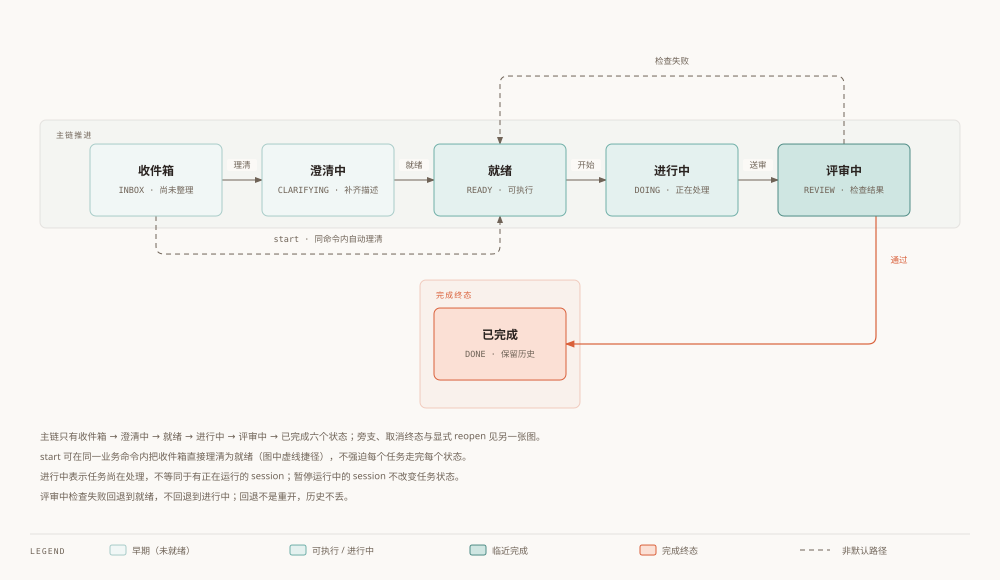

# Worktrace 数据模型

状态：评审修订草案，待用户评估。日期：2026-10-02。
上游：[总体架构](00-architecture.zh.md)；对应：[英文版](02-data-model.en.md)。
本次替换旧模型中的暂停累计方案；以下是逻辑结构，不是可直接执行的迁移脚本。

## 1. 版本与实体

| 版本 | 存储对象 |
| --- | --- |
| V0.1 | app_meta、application_run、project、task、work_session、work_interval、time_edit、task_change、daily_plan、tag、task_tag |
| V0.2 | goal、milestone、task_dependency、time_block、task_knowledge（实际使用标记） |
| V0.3 | ai_suggestion、ai_feedback；task/project 增加 security_level |
| V0.4 | context_fact、decision、document、task_document |
| V0.5 | knowledge_stat（可重建派生缓存） |

Goal/Milestone 外键在 V0.2 迁移时加入；不能在 V0.1 建引用不存在表的列并启用相关写入。V0.1 不显示这些对象的筛选器。实体 ID 使用 UUID 字符串；所有主键显式 NOT NULL（完整 DDL）；所有时间戳和时长单位分别为 Unix 毫秒、毫秒。UI 可显示分钟。

Project 可包含多个 Task；Task 自引用，叶子 Task 称 Action。Task 下有多个 WorkSession，每个 session 有一到多个有效工作区间 work_interval。它不是 V1 的活动细分 SessionSegment：这里只记录实际工作的起止，用于暂停与跨日报表。

## 2. 逻辑结构与数据库约束

```sql
-- Logical schema: full executable DDL and migrations belong to M01.
app_meta(singleton INTEGER PRIMARY KEY, revision INTEGER NOT NULL)
application_run(id TEXT PRIMARY KEY, started_at INTEGER NOT NULL, clean_exit_at INTEGER)
goal(id TEXT PRIMARY KEY, title TEXT NOT NULL, description TEXT, status TEXT NOT NULL,
     created_at INTEGER NOT NULL, updated_at INTEGER NOT NULL)
project(id TEXT PRIMARY KEY, goal_id TEXT REFERENCES goal(id), name TEXT NOT NULL,
        description TEXT, status TEXT NOT NULL, created_at INTEGER NOT NULL, updated_at INTEGER NOT NULL)
milestone(id TEXT PRIMARY KEY, project_id TEXT NOT NULL REFERENCES project(id), title TEXT NOT NULL,
          status TEXT NOT NULL, due_at INTEGER, done_at INTEGER)
task(id TEXT PRIMARY KEY, project_id TEXT REFERENCES project(id), milestone_id TEXT REFERENCES milestone(id),
     parent_task_id TEXT REFERENCES task(id), title TEXT NOT NULL, description TEXT,
     status TEXT NOT NULL, priority_json TEXT, estimated_json TEXT,
     planned_duration_ms INTEGER, deadline INTEGER, importance INTEGER, urgency INTEGER,
     energy_required INTEGER, difficulty INTEGER, completion_criteria TEXT, quality TEXT,
     baseline_estimate_json TEXT, row_version INTEGER NOT NULL, created_at INTEGER NOT NULL, updated_at INTEGER NOT NULL)
work_session(id TEXT PRIMARY KEY, task_id TEXT NOT NULL REFERENCES task(id),
             run_id TEXT NOT NULL REFERENCES application_run(id), mode TEXT NOT NULL,
             state TEXT NOT NULL, timer_kind TEXT NOT NULL, target_duration_ms INTEGER,
             started_at INTEGER NOT NULL, ended_at INTEGER, last_heartbeat_at INTEGER,
             interruption_of TEXT REFERENCES work_session(id), quality TEXT,
             needs_review INTEGER NOT NULL DEFAULT 0, row_version INTEGER NOT NULL)
work_interval(id TEXT PRIMARY KEY, session_id TEXT NOT NULL REFERENCES work_session(id),
              started_at INTEGER NOT NULL, ended_at INTEGER, voided_at INTEGER)
time_edit(id TEXT PRIMARY KEY, session_id TEXT NOT NULL REFERENCES work_session(id),
          before_json TEXT NOT NULL, after_json TEXT NOT NULL, reason TEXT,
          created_at INTEGER NOT NULL)
task_change(id TEXT PRIMARY KEY, task_id TEXT NOT NULL REFERENCES task(id),
            before_json TEXT NOT NULL, after_json TEXT NOT NULL, created_at INTEGER NOT NULL)
daily_plan(task_id TEXT NOT NULL REFERENCES task(id), local_date TEXT NOT NULL,
           timezone TEXT NOT NULL, PRIMARY KEY(task_id,local_date,timezone))
tag(id TEXT PRIMARY KEY, kind TEXT NOT NULL, name TEXT NOT NULL,
    parent_id TEXT REFERENCES tag(id), created_at INTEGER NOT NULL)
task_tag(task_id TEXT NOT NULL REFERENCES task(id), tag_id TEXT NOT NULL REFERENCES tag(id),
         weight REAL, PRIMARY KEY(task_id,tag_id))
```

```sql
CREATE UNIQUE INDEX uq_running_foreground ON work_session(mode)
  WHERE mode='FOREGROUND' AND state='running';
CREATE UNIQUE INDEX uq_open_interval ON work_interval(session_id)
  WHERE ended_at IS NULL AND voided_at IS NULL;
CREATE UNIQUE INDEX uq_tag_root ON tag(kind,name) WHERE parent_id IS NULL;
CREATE UNIQUE INDEX uq_tag_child ON tag(kind,parent_id,name) WHERE parent_id IS NOT NULL;
CREATE INDEX idx_interval_session ON work_interval(session_id);
CREATE INDEX idx_task_project ON task(project_id);
CREATE INDEX idx_task_status ON task(status);
CREATE INDEX idx_session_task ON work_session(task_id);
```


完整 DDL 必须补齐 CHECK、NOT NULL、删除策略与索引，并逐次迁移。连接统一开启 foreign_keys；事务与备份由 M01 管理。

- session.state：running / paused / recovering / finished / discarded。每个 running session 恰好有一个未结束的有效 interval；paused/finished/discarded 没有；recovering 可保留一个未定终点的 interval，不参与正常计时。
- timer_kind：stopwatch / countdown，V0.2 扩展 pomodoro。target_duration_ms 是倒计时预算，不是派生显示值，正计时为 NULL。
- mode：FOREGROUND / BACKGROUND / PASSIVE / WAITING；V0.1 仅开放 FOREGROUND。暂停的前台 session 可多条，正在运行的前台至多一条；恢复也经过同一检查。
- interval 结束不得早于开始；同一 session 有效区间不重叠。人工历史区间不得与其他已确认人工区间重叠；服务在写事务内验证，不仅检查当前运行状态。
- task.quality 可在 Review、Done、Cancelled 有值，允许 abandoned 对应 Cancelled；非终结工作结果的状态质量为空。重开时清除当前质量，旧值保留在变更记录。用 CHECK 兜底允许的状态组合。
- 标签名先去首尾空白，空串拒绝；暂按大小写敏感比较。根级与子级分别唯一。只有 Knowledge 允许 parent_id；父子 kind 一致且无环，领域规则负责校验。
- 外键默认 RESTRICT；有计时历史的任务使用归档/软删除。项目归档保留所有历史；标签删除若仍被使用则拒绝，可先移除关联。
- 不存 task.actual_duration、elapsed、remaining 或 paused_total_ms。统计由有效 interval 求得；编辑日志是审计记录，不是第二份统计真相源。

## 3. 工作会话与计时

| 意图 | 同一个事务中的变更 |
| --- | --- |
| start | 校验任务可执行、前台占用 → 新建 running session 和 open interval |
| pause | 关闭 open interval → session 设为 paused |
| resume | 校验占用 → 新建 open interval → session 设为 running |
| finish | 若运行则关闭 interval → session 设为 finished，记录 ended_at |
| switch/interrupt（V0.2） | 暂停旧 session → 启动新 session，记录 interruption_of；任一步失败全部回滚 |
| correct | 检查 row_version、范围与重叠 → 编辑有效区间、写 time_edit、增加版本 |

暂停后恢复仍是同一 session；结束后再次开始是新 session。paused 也可直接 finish。完成/取消任务会结束其所有运行或暂停 session；若存在 recovering 记录，先返回 RECOVERY_REQUIRED，不悄悄确认历史。

显示 active_ms = SUM(已结束有效 interval 的 ended_at - started_at) + 当前 open interval 的实时工作时长。
paused 无 open interval，因此值冻结。倒计时 remaining_ms = max(0, target_duration_ms - active_ms)，超时另显示 overtime_ms；到点只提示，不自动完成任务。恢复不会消耗暂停期间的预算。

运行中用单调时钟测量时长，墙钟用于持久化时间归属。系统改时、休眠或时钟不连续不能靠 now-started_at 掩盖；在最后可信检查点停止可疑区间并进入 recovering，由用户校正。跨重启不复用单调时钟。

建议默认：前台在锁屏/休眠时暂停，恢复后由用户继续；后台/机器任务的休眠时间单独确认。这是产品待评估项，见 [评审摘要](06-review-notes.zh.md)。M04 的精度验收必须针对选定策略，并测试向前/向后改时。

## 4. 崩溃恢复与退出

单实例检查成功后才能初始化运行记录。每次进程启动新建 application_run；所有属于旧 run 的未结束 session（包括 paused）进入 recovering，置 needs_review=1。不以“心跳超过两分钟”作为门槛，因此强杀后立即重启也会恢复。心跳约每 30 秒持久化，给出最后可信时间及不确定区间，不证明该段已经完成。

恢复记录不自动运行，不占 running 前台槽位，整个待确认 session 暂不进入已确认统计。用户可选择确认截止时间、修改区间、保存为暂停并显式恢复、或丢弃。确认时关闭不确定 interval，验证重叠并记录修正日志；丢弃保留审计。UI 单列待确认时间，不能静默显示为 0。

关闭窗口仅隐藏/关闭界面，不退出核心。显式退出在一个事务内结束 running/paused session、保存修订号与 clean_exit_at；有 recovering 记录则保留待确认。崩溃发生在提交前后均由事务和下一次扫描处理，不依赖退出事件必定送达。

## 5. Task 状态与层级

| 当前状态 | 允许的目标状态 |
| --- | --- |
| Inbox | Clarifying、Ready、Cancelled |
| Clarifying | Inbox、Ready、Cancelled |
| Ready | Doing、Scheduled（V0.2）、Blocked、Waiting、Review、Done、Cancelled |
| Scheduled（V0.2） | Ready、Doing、Blocked、Waiting、Review、Done、Cancelled |
| Doing | Ready、Blocked、Waiting、Review、Done、Cancelled |
| Blocked / Waiting | Ready、Cancelled |
| Review | Ready（检查失败）、Done、Cancelled |
| Done / Cancelled | Ready，仅显式 reopen；保留历史 |



> 图：主链六个状态的推进与回退。色深 = 推进程度，已完成是唯一强调终态；旁支、取消终态与显式 reopen 见下一张。

V0.1 不开放 Scheduled；Today 的“今日计划”是简单今日选择列表，排期另由 V0.2 time_block 管理。从 Inbox 直接 start 可在同一业务命令内先理清为 Ready，不强迫经过每个状态。

暂停不必改变 Doing：Doing 表示任务尚在处理，不等同 running session。设为 Blocked/Waiting 时暂停运行 session；取消/完成时结束；后台会话结束不自动完成任务。

V0.1 无父子任务 UI。V0.2 默认只对叶子任务计时，父节点工时由后代聚合且去重；子任务完成不自动完成父任务。父子同项目，里程碑属于同项目，不能形成环。改变归属在事务内校验整棵子树。

task_dependency 仅存一个规范方向（predecessor_id → successor_id）；blocks/depends_on 是同一关系的两种视角，拒绝自依赖和依赖环。related/parallel 为非阻塞关系。time_block 独立存 task_id、start_at、end_at、timezone，保留多次排期，不复制进 Task 两列。

## 6. 统计与标签

统计范围统一为半开区间 [from,to)。每段有效 interval 与范围交集：max(0,min(end,to)-max(start,from))，运行区间的 end 使用同一快照时刻 now。已确认已结束时间和实时暂计值分开标注；recovering/discarded 排除。

人工仅 FOREGROUND，机器分别汇总 BACKGROUND/PASSIVE，WAITING 单列。禁止将并行机器时长加成人工；报表必须返回 measure、timezone、range、as_of、revision。

关联时长：所有关联标签都计全部人工时长，与 weight 是否存在无关；多个标签之和可大于人工总量，UI 明示不可相加。
加权工时：只在同一 kind 内分配；weight 为 NULL 表示未分配，非 NULL 要求有限且 0..1。权重总和小于 1，差额归“未分配”；超过 1 拒绝保存；不偷偷归一化。Knowledge 层级汇总对子孙任务/区间去重，不能直接相加父子关联时长。

建议默认按当前标签、项目归属与权重重算历史，UI 明示“按当前分类”；导出保存当时结果与筛选口径。若用户要求历史分类冻结，再增加 session 分类快照，见待评估项。task_tag 与 task_knowledge 不重复存同一权重，知识权重唯一来自 task_tag；task_knowledge 只记录 required_level、used、learning_gain 等任务特定信息。

## 7. AI 与上下文（后续迁移）

V0.1 priority_json/estimated_json 就使用稳定信封：value、source(user/rule/ai)、confirmed_at、updated_at；预计值统一毫秒。V0.3 增加 suggestion_id。确认不把 source=ai 改成 user：source 表示来源，confirmed_at 表示人已确认；所有已确认值禁止后台覆盖，显式重新采纳/编辑例外。

ai_suggestion 保存 task_id、kind、输入任务版本、provider/model、prompt_version、建议值、生成时间、状态（pending/accepted/edited/rejected/stale）、原始估时和来源；ai_feedback 关联 suggestion_id。保留被拒建议及采纳后修改，才能统计接受率和估时误差。输入版本改变时旧建议变 stale；模型自报 confidence 与历史校准置信度分列，样本不足显示未知。

V0.3 task/project security_level 默认 STRICT_LOCAL，外发前按 M09/M10 白名单策略检查。V0.4 context_fact 只允许同项目同 key 的当前值一条（部分唯一索引 WHERE superseded_by IS NULL）；取代必须同事务插入新值并链接旧值。document 引用路径外还存内容哈希/修改时间，提取缓存继承文件保密等级；task_document 补齐外键。不能因重新分类而清除来源保密标记。

knowledge_stat 是可重建结果，保留 algorithm_version、sample_count、computed_at；V0.5 评分仅作为实验结果，不用累计时长直接推导能力。

## 8. M01/M05 必测案例

暂停后重启、暂停直接结束、恢复前台冲突、并发 start、跨午夜含暂停、空范围、同名根标签、历史工时重叠、强杀后十秒内重启、运行/暂停时退出、前后改系统时间、旧版本编辑冲突、区间修正后报表重算、待确认排除与显式确认。

## 9. 明细历史、估时基准与恢复实现

V0.1 task_change 记录任务状态/质量/归属变更，与实体更新同事务，用于重开历史和按日期统计完成。daily_plan 存今日选择日期及时区，不用任务 updated_at 推断今天安排。第一次 start 时将当前估时信封冻结到 baseline_estimate_json；后续改估时不改基准，显式重新定基准须保留 task_change，已有工作任务需标“非开工前估计”。估时误差默认对比确认人工时长，未完成记录不混入完成样本。

所有依赖/范围约束在 M01 完整 DDL 中有对应 CHECK/索引或服务事务校验。work_interval 修正只对 finished/recovering 会话进行；运行/暂停记录须先结束/确认再编辑。操作失败不得出现半个审计记录。

恢复数据库：停计时、暂停写入、关闭连接 → 当前库一致备份 → 在临时路径验证待恢复库完整性/外键/schema（未来版本拒绝，旧版本先备份再迁移）→ 同目录可回滚切换 → 重开校验；失败还原原路径并重新打开原库。不能覆盖仍打开的 WAL 数据库；备份包含恢复所需的全部数据。格式版号、数据库版号和应用版本分别记录。

## 10. 服务契约补充

- 手工输入的 priority/estimate 自动标 source=user、confirmed_at=操作时刻；采纳 AI 保留来源但获得同等保护。基础信封仅容纳既定字段，不使用任意属性 EAV。
- 恢复后显式 resume 将 session.run_id 切到当前 application_run，更新心跳；原始恢复归属保留 time_edit。否则下一次启动可能将新会话误当旧进程记录。
- Project 状态 active/archived/done；归档项目不能新启动 session，但其历史仍可修正。Goal 为 active/done/dropped；Milestone 为 open/done/cancelled。重要/紧急度和精力/难度的值域在完整 DDL 明确，V0.1 可不展示精力/难度输入。
- 完成任务写 task_change；报告按该记录的时刻选完成项，不以 updated_at 或 session 结束时间代替。完成后重开显示“重新打开”，避免周报宣称仍已完成。
- 倒计时暂停和工作区间预算为执行计时；time_block 的固定日程截止时刻不会因暂停后移，二者不能混用。
