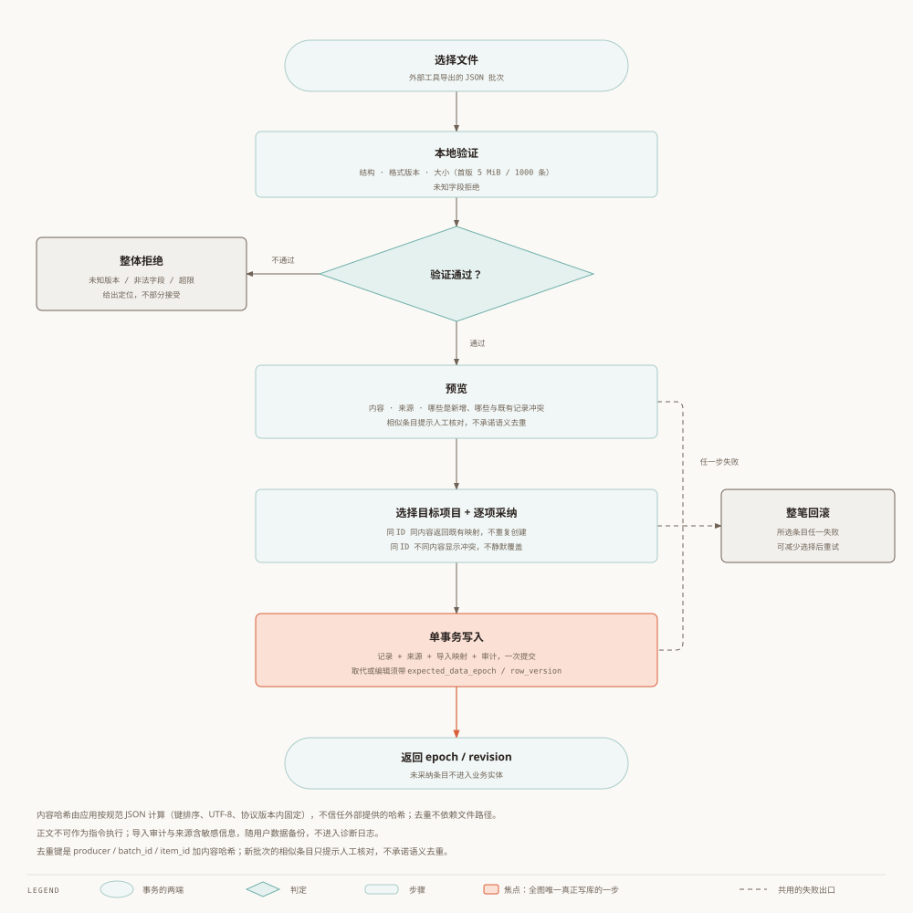

# Worktrace scope and external Agent import contract

Status: revised to the user-confirmed scope; 2026-10-03. Target design, unimplemented. [中文](07-scope-and-agent-import.zh.md).
[Architecture](00-architecture.en.md) · [Module breakdown](01-module-breakdown.en.md) · [Data model](02-data-model.en.md) · [ADR](03-adr.en.md) · [Functional spec](04-functional-spec.en.md) · [Roadmap](05-roadmap.en.md) · [Review notes](06-review-notes.en.md) · [Glossary](99-glossary.en.md) · [Other language](07-scope-and-agent-import.zh.md)

## 1. Purpose and responsibilities

Clarify and arrange work, record effort/outcomes, identify capability gaps, and prepare traceable reviews/KPA evidence. Daily capture, timing and short outcome/problem notes require no Agent. Projects/tags/evidence are optional.

Keep tasks, effort, scheduling, tags, brief facts/decisions, record search, AI suggestions/reviews, capability profiles and KPA. External Agents/companion skills read files and perform OCR, analysis, extraction and full-text search. No directory scanning, source-body cache or content monitoring in the app. Imported text never executes commands. References open only on explicit action with path/URL checks; reject executable/dangerous schemes, never auto-access to check existence.

The companion skill is a future deliverable: this revision defines its contract without creating/installing it. Users authorize files/models in the external tool; skills neither grant permissions nor guarantee redaction. Imported information may be sensitive; adoption never authorizes outbound sending.

## 2. AI, capability and KPA

AI off by default. Select records, preview actual input and provider/endpoint, then confirm per action; input version/destination changes require reconfirmation. Keep clarification, decomposition, estimates, tags, priority/scheduling, brief-input checks, summaries and feedback. Adopt individually; never auto-time or modify facts. Code computes numbers, AI drafts prose, users review. All core functionality works without a model.

Capability profiles combine usage, self-assessment, estimate error and rework/blocker causes; connect evidenced gaps to learning/practice tasks and follow-up reviews. Optional proficiency/scores distinguish self-report/inference and disclose evidence, sample size, algorithm, Unknown and limits. Effort alone does not measure ability. KPA organizes dated tasks, confirmed effort, milestones, outcomes and evidence by period/project with traceability; no invented benefits or automatic performance grades.

## 3. JSON file protocol (schema_version=1)

Batch fields: schema_version, batch_id, generated_at (timezone-bearing ISO 8601), producer (tool/skill/skill_version), items. Item fields: stable item_id, kind, content object and sources. Kinds: task, project_note, fact, decision, outcome. Sources contain title/reference/optional locator/optional observed_at. Sources are producer claims, not verified files/technical conclusions. External IDs are namespaced, never DB primary keys.

Minimum content: task.title with optional description/completion_criteria; project_note.title/body; fact.key/value; decision.title/rationale/decided_at; outcome.title/body/occurred_at. Dates carry timezone; only occurred_at/decided_at may be null for unknown; never use the string unknown but never fabricate effort/time. Preview maps projects/tags/references. Initial import does not import timer/session/intervals, historical completion timestamps or overwrite states. The [Chinese version](07-scope-and-agent-import.zh.md) includes a shared JSON example.

## 4. Transaction and failures

Choose file → locally validate schema/version/limits → preview content/provenance/new/conflicting items → map project and adopt selected items → one transaction writes selected records, sources, mappings and audit → return epoch/revision. Unselected items never become business records. Reject unknown schema versions, invalid kind/fields/dates and excess size with item locations. Initial limits: 5 MiB/1000 items, performance to be validated by M01. Reject unknown fields; never execute imported text.

Same deduplication identity (defined in §6) and identical canonical content hash returns existing mapping. App computes hashes defined by the protocol details below; never trust supplied hashes. Same ID with changed content is an explicit conflict. Similar new-batch items require human review; no promised semantic deduplication. Replacements/edits require explicit mapping plus expected_data_epoch/row_version. Any selected-item failure rolls back the entire adoption transaction; reduce selection and retry. Provenance/audit is user data included in backup, never diagnostic logs.

> Validate the whole file structurally; atomically commit or roll back the user-selected adoption set. Unselected items never become business records.

## 5. Delivery and acceptance

V0.1 short outcome/problem notes and manual evidence references; V0.3 confirmed AI inputs/suggestions; V0.4 JSON imports and companion skill; V0.5 capability action reviews and KPA. Test no linked-source-body reads (import JSON and user records may be read), unknown/invalid versions, repeated adoption, changed-ID conflicts, selection/rollback, stale-edit conflicts, provenance, unsafe-reference rejection and absence of automatic network/AI calls. Skill/app share protocol fixtures; skill updates never silently change protocol.

See [08: timing, phases, AI and report snapshots](08-implementation-contracts.en.md).

## 6. Exact fields, identity and errors

See [JSON Schema](agent-import.schema.json) and [valid fixture](examples/agent-import.valid.json). Structural schema is supplemented by calendar-date, unique batch item_id, size, target mapping and transaction checks. Version 1 fact.value is a nonempty string; unknown outcome/decision dates are null, never unknown strings; other required fields stay nonnull.

Identity: producer.tool + producer.skill + batch_id + item_id; skill_version is metadata. SHA-256 hashes kind/content/sources; source array order preserved, recursive object keys sorted by UTF-16, whitespace-free JSON.stringify, UTF-8, no Unicode normalization; exclude generated_at/producer versions. Content has strings/null/objects/arrays, no float canonicalization. Retain canonical content for diagnosis.

Changed content: IMPORT_CONTENT_CONFLICT. Deleted/voided/edited mapped target: IMPORT_TARGET_CHANGED, explicit restore/new choice, never silent recreation/overwrite. Different target project: IMPORT_MAPPING_CONFLICT. Invalid structure/date/duplicate item IDs: IMPORT_VALIDATION_FAILED; unknown schema: IMPORT_SCHEMA_UNSUPPORTED. Any selected-item conflict rolls back the whole transaction.

Maximum 100 sources per item; reject duplicate JSON keys, whitespace-only required strings and invalid dates. Optional locator/observed_at may be omitted or null. Empty sources is allowed but visibly marked unsourced/unconfirmed. [Invalid fixtures](examples/agent-import.invalid-cases.json) cover schema and domain validation; §6 defines errors.
