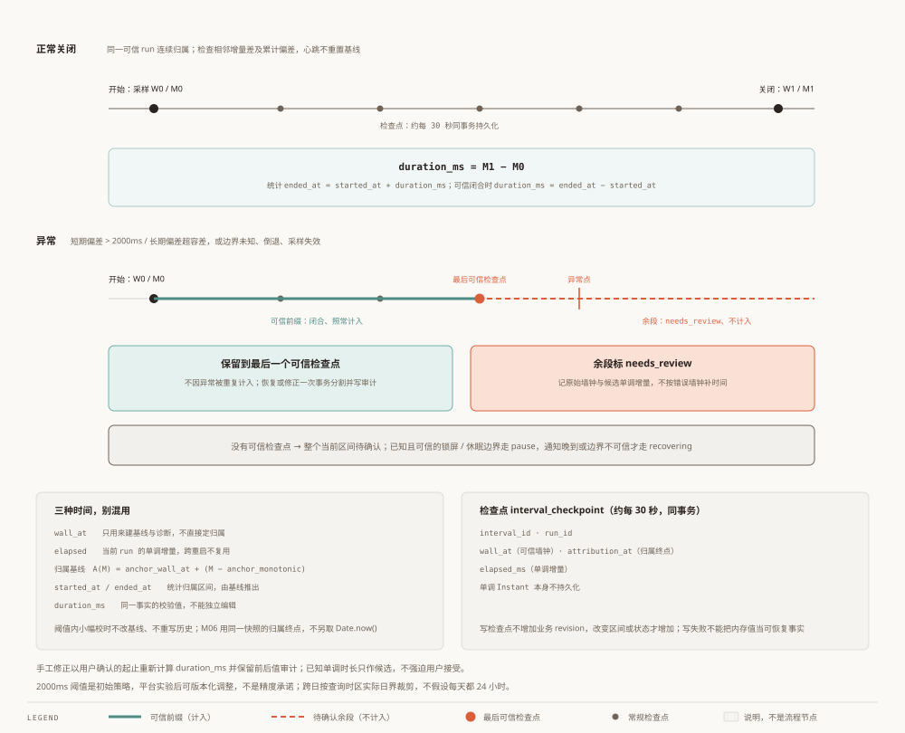
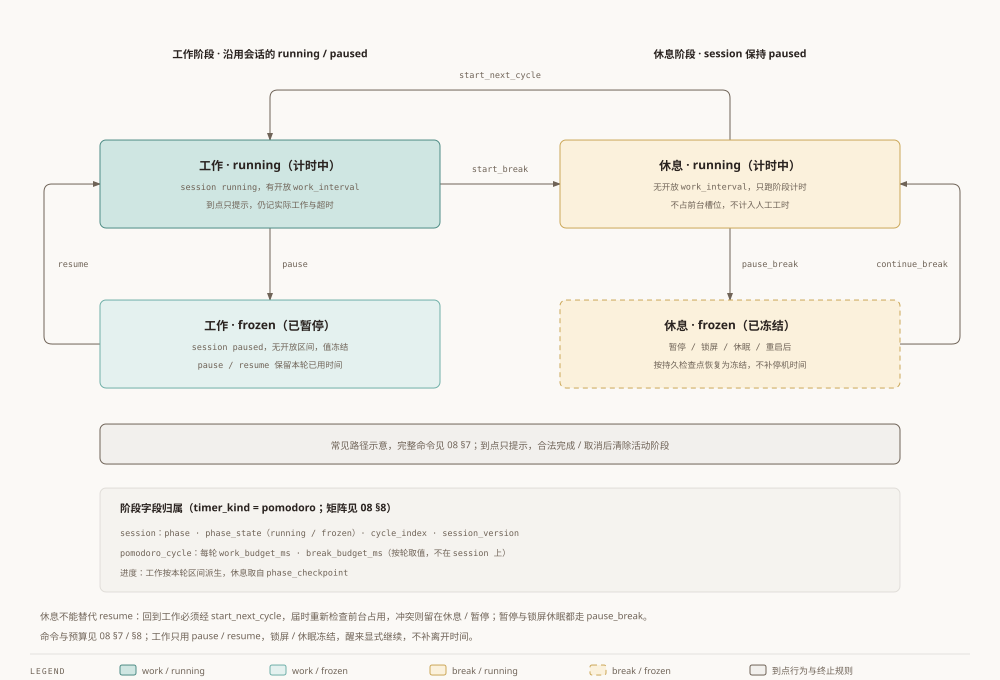

# Worktrace 实施契约补充

状态：2026-10-03 完善提案，待审核；尚未实现。[English](08-implementation-contracts.en.md)。本页细化 02/04/07；应用实现前须同步验收，不替代平台实验。
[总体架构](00-architecture.zh.md) · [模块分解](01-module-breakdown.zh.md) · [数据模型](02-data-model.zh.md) · [ADR](03-adr.zh.md) · [功能验收](04-functional-spec.zh.md) · [路线图](05-roadmap.zh.md) · [评审摘要](06-review-notes.zh.md) · [范围与导入契约](07-scope-and-agent-import.zh.md) · [术语](99-glossary.zh.md) · [另一语言](08-implementation-contracts.en.md)

## 1. 区间时长与时间归属（V0.1）

明确三种时间：实际墙钟采样 wall_at、当前 run 的单调 elapsed、统计归属区间 started_at/ended_at。有效工作区间仍是唯一统计事实，session 合计和倒计时都是派生值。

正常运行：开始采样 W0/M0，关闭时用单调差得 duration_ms，统计 ended_at=started_at+duration_ms。关闭的可信区间满足 duration_ms=ended_at-started_at，均为非负整数毫秒；duration_ms 是同一事实的校验值，不能独立编辑。原始墙钟关闭值保留作诊断依据，不拿它直接减开始时间。运行暂计由同一协调器采样单调增量，M06 使用该次快照的归属终点；不能另取 Date.now()。手工修正以用户确认的起止重新计算 duration_ms，并保留前后值审计。

心跳约每 30 秒同事务保存 interval_id、run_id、可信 wall_at、attribution_at、elapsed_ms；单调 Instant 不持久化。心跳也先检测本次采样，不能用上一拍结果或写入间隔跳过检测。相邻墙钟/单调增量差、相对最近成功心跳参照点的偏差各自绝对值 >2000ms 触发恢复判断；另外 abs(sampled_wall_at-L(M)) > 2000ms + floor((M-lifetime_monotonic_at)×500/1_000_000) 为不随心跳清零的长期边界。归属 anchor 在连续可信运行期间固定；旧开放事实闭合或隔离后才允许重建；500 ppm 为初始版本化容差，依据本机约 233 ppm 实测保留余量，不是通用平台结论或精度承诺。倒退、采样失效、不可信事件边界或无可靠通知的长间隔也触发恢复判断。

异常时保留至最后可信检查点的闭合前缀，剩余部分标 needs_review 并记录原始墙钟/候选单调增量；不自动按错误墙钟补时间。没有可信检查点则整个当前区间待确认。可信前缀不因异常被重复计入；恢复/修正一次事务分割并写审计。已知且可信的锁屏/休眠边界走 pause；通知晚到、边界不可信则走 recovering，由用户确认离开前工时。恢复期间不继续人工计时。

> 图：三种时间各管一件事——墙钟负责归属，单调负责时长，两者之差负责发现「这段不可信」。

新 run 或显式校正后建立新的可信归属基线，若与可信人工历史重叠则要求显式确认归属。正常连续 run 内按下面的基线规则开始下一段，不每段重新采用墙钟；不自动移动既有记录。确认可疑工时必须给出合法、不重叠的归属起止；已知单调时长仅作为候选，不强迫用户接受。跨日按查询时区实际日界裁剪，不假设每一天都是 24 小时。检查点写入不增加业务 revision，改变区间或状态才增加；失败写检查点不将内存检查点当作可恢复事实。

长期边界使用独立参照 L(M)=lifetime_wall_at+(M-lifetime_monotonic_at)，abs(sampled_wall_at-L(M)) > 2000ms + floor((M-lifetime_monotonic_at)×500/1_000_000)。A(M) 仅用于工时归属，不作为长期偏差参照。三个参照分别为：归属 anchor（旧开放事实闭合/隔离后才可重建）、短期 drift_ref（成功心跳或归属重建时移动）、长期 lifetime_ref（新 run 初始化，或已检测墙钟偏移/漂移的审计提交后移动）。普通 pause/resume、可信系统离开边界、无可靠边界的长间隔、采样失败均不得移动长期参照；单调钟倒退不是墙钟校正，须隔离并由新 run 安全重建。

暂停/终结态遇墙钟异常时，先原子写 clock correction 审计并增加 revision，再接受新归属与长期参照；暂停会话版本递增，终结态不修改会话或历史区间。随后 resume 使用新版本，不会成功后立即再次恢复。此处“接受校正”仅表示承认新的时钟映射，不代表确认可疑工时。recovering 记录重复事件保持幂等；未接受的墙钟异常仍存在时拒绝 start/resume，而不是先返回成功。**被拦住的是「未接受的墙钟异常」本身，不是「存在 recovering 会话」**：未接受的墙钟异常会持续被长期界 L(M) 重检出，因此它一直拦住 start/resume（包括别的任务）；而长间隔或采样失败造成的 recovering 只是把该会话的余段标成待确认（留给 P3 `reconcile`），不阻止别的任务开始计时——该 recovering 会话自身的普通命令照旧拒绝。

已检测但未接受的墙钟校正使用独立 run 内标记持续阻止 start/resume 与统计采样，不以长期容差是否仍越界作为解除条件。只有校正审计提交后的接受路径可清除；普通查询、心跳、暂停或容差随时间增长不能解除。新 run 必须先按持久化事实安全启动恢复；P3 显式接受校正独立于确认可疑工时。system_pause 仅对当前样本检测一次，历史 boundary 不推进 last；可信边界只解释长间隔，不能覆盖单调钟硬故障或墙钟异常。**未接受标记与校正审计都以「存在会话」为前提**：本 run 尚无会话时，墙钟变化没有工时事实可牵连，也没有可挂审计的会话（`time_edit.session_id` 非空且外键指向 `work_session`），因此在下一次 `start`/`resume`（会话镜像为空）时用当前样本**整体重定基线**（含长期参照），不写审计、不置标记——否则新会话会拿旧基线算归属，整整偏出跳变量。判据按「本 run 是否装载过会话」，不按「是否已有基线」：run 初始化本来就建立基线。本 run 一旦装载过会话，长期参照的生命期规则照旧。**上一个 run 留下的会话不得由本 run 以「可信」方式改写**：闭合它的开放区间会把停机（崩溃、休眠、关机）算成已确认工时，因此 `pause`/`finish` 的结束原语与 `checkpoint_repo::write` 用**同一判据**（会话 `run_id` 与本 run 不一致 ⇒ `StaleRunContext` ⇒ `RECOVERY_REQUIRED`），且该校验排在版本校验**之前**；跨 run 事实必须先经启动扫描与恢复流程处理，不能靠客户端刷新版本后重试。

基线缺失时，无论是否已经装载暂停会话，start/resume 都必须先用当前采样初始化基线；“本 run 尚无会话”重定规则不能替代这一缺失检查。无基线的统计/快照归属终点使用同次采样墙钟，不能用进程单调读数代替时间戳。可信平台 boundary 先检查时间范围，再用当前观察之前的检测器副本复用短期、长期判据；副本不推进真实 last。平台可信边界可解释长间隔，但不能豁免时钟异常，不能把相对 A(M) 的累计偏差与短时间容差混用。

## 2. 番茄钟阶段（V0.2）

timer_kind=pomodoro 额外增加阶段状态：session 上是 phase(work/break)、phase_state(running/frozen)、cycle_index；work_budget_ms/break_budget_ms 在轮次表 pomodoro_cycle 上按轮取值，不在 session 上；进度存于 phase_checkpoint（休息）或由该轮区间派生（工作）。字段矩阵与状态版本见 §8。工作阶段沿用 running/paused 工作区间；休息阶段 session 保持 paused，无开放 work_interval，只运行独立阶段计时。休息不占前台槽位、不进入人工工时。

工作到点只提示，仍记实际工作及超时；用户显式开始休息才闭合工作区间并切 break。休息到点只提示，用户显式开始下一轮才重新检查前台占用并打开区间；占用冲突保持原阶段状态（§7 表：失败原状态不变）。暂停冻结当前阶段，继续休息不等于 resume 工作。锁屏/休眠冻结阶段，醒来显式继续；重启后工作按区间恢复规则，休息按持久检查点恢复为冻结，不补停机时间。完成任务结束所有阶段。工作段预算与整次 session 工时分别显示，不能用累计工时减每轮预算。

> 图：休息是阶段而不是会话状态——它跑在 paused 的 session 里，没有工作区间，也不计人工工时。

## 3. 成果、背景与版本依赖

V0.4 增加最小 outcome(id、project_id、task_id 可空、title、body、occurred_at 可空、source、confirmed_at、row_version) 和 outcome_source；Agent 的 outcome 在此版即有目标实体。project_note/decision/context_fact 与引用都具备 row_version、来源和确认历史。occurred_at 是用户确认或导出者声明的成果日期，不是 task 完成时间；未知用 null。AI 拆分只创建用户选中的子任务，不隐式改父任务状态。

V0.5 扩展成果分类、自评、练习记录与能力行动复盘，基于 V0.4 实体，不另建第二套成果事实。导入映射必须通过目标类型/ID 与存在性校验，不能只有无约束字符串。

## 4. AI 总结与排期

V0.3 补充两个验收条目：F-209 AI 总结、F-210 AI 排期建议。总结输入带明确周期、时区、measure、epoch/revision，以及选中记录 ID/版本；数值由程序计算，已确认/暂计/待确认分列。输出分事实引用、用户备注、AI 推断，引用必须落在输入白名单，不能编造来源、节省时间或能力结论。输出无法通过引用/结构校验则不允许标为已确认报告。

排期只采用选中任务、已有依赖、确认估时、截止日期及用户提供的可用时段；缺少估时/时段提示补充，不假设全天可用。AI 输出候选 time_block，采纳时领域服务重新校验时间范围、任务状态、依赖与冲突，逐项选择的结果整体提交。版本变更返回冲突后重算，不静默修改已有排期、不自动启动计时；不会将建议误称为可保证按时完成的计划。

## 5. KPA 快照与可复现（V0.5）

草稿可更新；用户确认的 report_snapshot 不再原地更新。保存周期、时区、筛选/分类口径、measure、生成时 epoch/revision、引用实体及版本、当时事实/成果/来源的必要拷贝、模板/模型/提示版本和最终确认文本。只有引用 ID 不足以复现被修正的历史。

修改工作记录产生新 revision；报告重新生成是新快照并关联前一版，旧版可回看，显示源记录已变更但不改旧版数字。文件引用是历史定位，不承诺源文件永久可打开或内容从未变化；外部提供的哈希标记为声明值。备份包括快照及来源。AI 输出未确认、归属不明或待确认时间必须显式标识，不混入确认贡献。

## 6. 实施前检查

验证：正反改时、锁屏通知延迟、重启与检查点失败、跨日/时区日界、休息不计工时和冲突、V0.4 outcome 导入及来源、旧输入 AI 结果、排期非法/冲突、KPA 修正后旧版可复现。先完成 V0.1 闭环，后续规格按版本落地；不得以本文示例检查冒充实机验证。

补充边界：start/resume 同事务创建 elapsed_ms=0 的初始检查点；阶段变化同样增加 session_version。原始墙钟采样只作为用户数据保存，不写诊断正文。报告的任务开始取该工作轮次首个确认区间，完成取 task_change 完成事件；重开后分别列出轮次，不把 updated_at 当完成日期。

## 7. 连续归属基线与阶段命令（本轮修正）

一个连续、可信 run 段保存内存基线 anchor_wall_at/anchor_monotonic；归属终点 A(M)=anchor_wall_at+(M-anchor_monotonic)。它包括段间的正常暂停时间，但人工时长仅计算开放工作区间。开始/继续工作的 started_at 取该次协调器采样的 A，不取独立墙钟；结束取 started_at+本区间单调工作增量。阈值内小幅校时不改变基线、不重写历史，因此相邻区间不会因 500ms 墙钟偏差重叠。

每次采样按 §1 三项判据检测：短期 2000ms 边界与带 500 ppm 初始容差的长期边界同时保留。成功心跳可移动短期检测参照点，但不重置归属 anchor 或长期偏差。可信平台离开边界按策略 pause；两钟同步的长间隔无法证明休眠开始时刻，边界不可信则 recovering。采样失败时保留可信检查点之前的前缀，余段终点未知（ended_at=null、duration_ms=null），不能将旧样本伪装为本次终点。正常采样失败不自动恢复计时；异常事务失败隔离全部入口，须成功重试恢复或按持久化事实安全重建。采样、检测、可信前缀及检查点写入串行处理，可疑样本不得写为可信检查点。新 run、唤醒、显式校正后不能继承 Instant，并验证新的人工归属与历史冲突。待确认候选范围不自动算成可信重叠事实；后来确认仍须校验。

休息阶段检查点独立保存为 phase_checkpoint(session_id、run_id、phase、cycle_index、session_version、phase_elapsed_ms、sampled_at)；不挂在旧工作 interval 上。写入须匹配当前阶段/版本；纯进度检查点不增加 revision，phase/phase_state 切换必须增加 session_version 和业务 revision。会话 finished/discarded 时清除活动阶段（phase/phase_state=null），历史保留审计。

本表引用 02 §3 的命令登记；同名命令是同一个入口，这里只列番茄钟附加条件。

| 命令 | 前置状态 | 结果 |
| --- | --- | --- |
| pause | work/running 且 session running | 闭合工作区间，work/frozen，session paused |
| resume | work/frozen 且 session paused | 检查前台占用，开区间，work/running |
| start_break | work/running 或 work/frozen，无待确认区间 | 运行时闭合区间；已暂停则不新建；切 break/running，elapsed=0，session paused |
| pause_break | break/running | break/frozen，无工作区间 |
| continue_break | break/frozen | break/running，只继续阶段计时 |
| start_next_cycle | break/running 或 break/frozen | 检查前台占用；成功 cycle_index+1、work/running、开区间，阶段 elapsed=0；失败原状态不变 |
| finish（同 02 §3） | session running/paused 且无待确认记录 | 执行统一 finish；番茄钟附加清活动阶段，recovering 返回 RECOVERY_REQUIRED |
| reconcile（同 02 §3，V0.1 已有） | session recovering | 统一恢复确认/丢弃不确定区间；保存 paused 时附加 work/frozen，不自动开始下一阶段 |

公开 pause/resume 统一用于普通计时及番茄钟 work 阶段；resume 不可用于 break，返回 POMO_STATE_CONFLICT；休息需要 continue_break 或 start_next_cycle。任务取消同 finish 的阶段清理，但遇到 recovering 仍返回 RECOVERY_REQUIRED。恢复启动后的休息一律 break/frozen，工作一律按区间恢复，不自动补阶段时间。命令均检查 expected_data_epoch/row_version，非法状态不写入；到点只提醒，不触发上述跃迁。图仅展示常见路径，完整允许条件以本表为准。

V0.2 番茄钟 tick/查询/命令结果必带 phase、phase_state、cycle_index、phase_elapsed_ms、phase_remaining_ms、phase_overtime_ms；phase_remaining=max(0,本阶段预算-phase_elapsed)，人工 active_ms 在休息保持冻结。普通计时的阶段字段为 null；remaining_ms/overtime_ms 仅 countdown 非空，pomodoro 使用阶段字段，不能用普通剩余值展示工作轮次或休息倒计时。所有字段来自同一协调器快照，仍以 session_version 过滤旧 tick。

## 8. 统一命令、轮次进度与字段口径（本轮确认）

采用方案 (b)：只有公开 pause/resume，没有另一组公开工作阶段命令。02 §3 的 pause/resume 是基础操作，08 §7 是其番茄钟前置条件及阶段元数据扩展。普通计时沿用现有规则；pomodoro work/running 的 pause 闭合区间并设 work/frozen，work/frozen 的 resume 校验占用并开区间、设 work/running。break 调用这两个工作命令返回 POMO_STATE_CONFLICT，不写库；使用 pause_break/continue_break 或 start_next_cycle。前端、托盘及平台事件均调用同一协调器；界面“暂停/继续”按 phase 选择命令，而不是维护命令别名。

V0.2 增加 pomodoro_cycle(session_id、cycle_index、started_at、work_budget_ms、break_budget_ms)，主键为 session_id/cycle_index，预算保存该轮值。番茄钟 work_interval 增加 cycle_index，并校验其归属是同 session 的有效轮次；普通工作区间为 null。首次 start 建立第 1 轮；start_next_cycle 同事务建下一轮、更新当前轮号并开工作区间，失败整体回滚。每段工作在打开时绑定轮次，历史修正/异常区间分割必须保留轮次，不得把旧轮次区间改归当前轮次。

工作阶段 phase_elapsed_ms 是当前轮次可信有效区间时长之和，加当前开放区间的可信单调暂计；不保存成另一份工时真相。休息阶段 phase_elapsed_ms 由独立 phase_checkpoint 及运行基线取得。pause/resume 只关闭/新开工作区间，阶段累计不清零；新区间初始 elapsed_ms=0 是区间检查点值，与阶段进度不同。start_break 建立休息阶段且休息进度为 0；start_next_cycle 创建新轮且工作进度为 0。continue_break 保留休息已消耗时间。

重启时先按区间恢复规则处理，再按当前 cycle_index 汇总可信工时：10 分钟工作、暂停后强杀，重启仍显示该轮已用 10 分钟，而不是从零开始。若当前区间有待确认部分，显示确认进度与待确认分列，不使用猜测值推进预算；确认/丢弃后按原轮次重算，并保存 work/frozen。休息从最后成功 phase_checkpoint 恢复为 frozen，不计停机时间。修正同轮历史必须重算当前进度并增加 session_version，使旧 tick 失效。

| timer_kind | 普通预算字段 | 阶段字段与剩余时间 |
| --- | --- | --- |
| stopwatch | target_duration_ms/remaining_ms/overtime_ms 均 null | 全部 phase 字段 null，active_ms 正计时 |
| countdown | target_duration_ms 必填；remaining=max(0,target-active)，overtime=max(0,active-target) | phase 字段均 null，暂停冻结工作累计 |
| pomodoro | target_duration_ms/remaining_ms/overtime_ms 均 null | work_budget_ms/break_budget_ms 来自当前轮；phase_remaining=max(0,本阶段预算-phase_elapsed)，phase_overtime=max(0,phase_elapsed-本阶段预算) |

会话终态仍返回确认 active_ms；番茄钟 phase/phase_state/phase_elapsed_ms/phase_remaining_ms/phase_overtime_ms 为 null，轮次历史从明细查询获取。pause/resume/reconcile 的规则和 UI 不能从 session=paused 推断休息是否冻结，必须读 phase_state。

验收示例：25 分钟工作阶段做 10 分钟，pause/resume 后剩 15 分钟；下一轮剩 25 分钟而累计人工保留前轮。休息 5 分钟做了 2 分钟，pause_break/continue_break 后剩 3 分钟。暂停工作重启保留本轮进度；异常区间确认后按原轮重算；旧轮不混入新轮；普通计时与番茄钟返回的 null 字段符合上表。

命令关系补充：finish 是跨计时类型的同一命令，08 只扩展阶段清理；reconcile 从 V0.1 起就是恢复命令，不能误读为 V0.2 新增。correct 仅修正 finished 历史；reconcile 可在同事务内部复用区间修正/结束原语，但不能别名为 correct 或 finish。完整入口、版本及恢复参数以 02 §3 为准。
